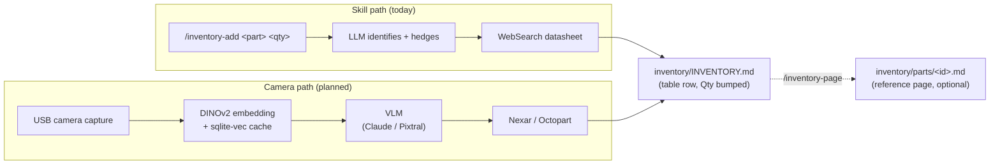
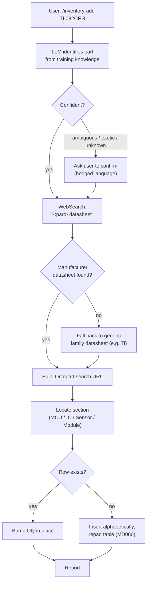
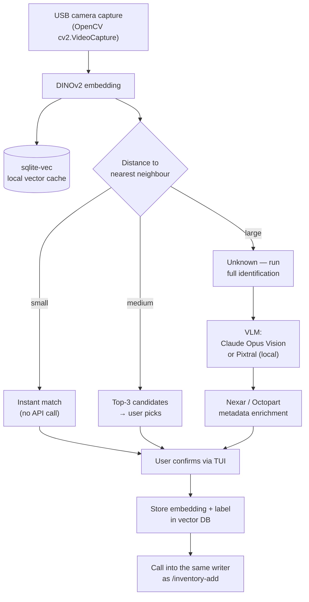

# PartsLedger — Concept

> *"PartsLedger keeps the record. CircuitSmith reads it before forging."*

## Goal

A maker (through-hole, modules, dev-boards, larger ICs) wants to digitise their
parts bin. Two entry paths feed the same Markdown-based inventory:

- **Skill path (today):** the maker tells an LLM *"I have N of part X"*; the
  LLM identifies it, finds the datasheet, and writes the entry.
- **Camera path (planned):** the maker holds a component under the USB
  camera; a vision pipeline identifies it and writes the same entry.

With every use, the inventory becomes richer and the system becomes faster —
no explicit training, no separate database.

## Target Audience & Scope

- **Makers / hobbyists**: through-hole components, modules (Blue Pill, ESP32,
  WeMos D1 Mini, DRV8825, HC-SR04, MAX7219 …), dev-boards, larger ICs in
  DIP / TO-220 / SOIC.
- **Deliberate non-goals**: SMD micro-parts (SOD-323 diodes with 2-3-character
  marking codes), industrial AOI applications, multi-user web frontend with
  audit trail.

## Core Idea: LLM-Native Markdown Inventory

The inventory is **not** kept in a SQL database, but in Markdown files. Two
files do all the work:

- `inventory/INVENTORY.md` — a single flat index. Sectioned tables (MCUs, ICs,
  Sensors, Modules, Transistors, Bulk/kits) with columns
  `Part | Qty | Description | Datasheet | Octopart | Notes`. **The source of
  truth for "what do I have and how many".**
- `inventory/parts/<id>.md` — optional, hobbyist-friendly **reference pages**
  for parts that earn one: ELI5, pinout, sample circuit, gotchas. Prose, no
  frontmatter. The Part cell in `INVENTORY.md` links to the page once it
  exists, so the index doubles as a navigable book.

Why this shape:

- LLMs (especially Claude) can read the whole inventory directly — `cat
  inventory/INVENTORY.md inventory/parts/*.md` is the only "query layer" you
  need.
- Git is the history — every stock movement is a commit; `git log
  inventory/INVENTORY.md` shows who arrived and who left.
- Tool diversity: Obsidian, VS Code, grep, GitHub web UI all work unmodified.

## Two Entry Paths, One Target

Both paths converge on the same files. The skill path is what works today;
the camera path is the planned second entry point.



The key invariant: **whichever path writes, the file format is identical.**
The skill path is hand-driven and verbose; the camera path is glance-driven
and bulk-friendly. They produce the same rows and the same pages.

## The Skill Path (today)

Two skills do all the work, both LLM-orchestrated, neither needing any
hardware beyond a keyboard.

### `/inventory-add <part-id> <qty>` (also batched: `…, <part-id> <qty>`)



Specials:

- **Bulk / kits** (generic classes like "1N4148 diodes" or "carbon-film
  resistor set") skip the row workflow and go to the **Bulk / kits** section
  as a bullet entry — we don't catalogue individual values.
- **Hedge language is mandatory.** *"Likely the X from Y"*, never *"is X"*.
  The user is ground truth; the LLM is a guess until they confirm.
- **Package assumption**: the maker's drawer is through-hole. Function
  descriptions never claim a SOIC variant even when the marking suggests
  it — the physical part on the bench is the ground truth.

### `/inventory-page <part-id>`

Generates a one-page reference for a part that's already in `INVENTORY.md`,
then links the Part cell to it. The page is prose for a hobbyist, not a
machine schema:

| Section | Purpose |
|---|---|
| Title + one-paragraph overview | What it is, what it's for, package |
| Datasheet + Octopart links | Reused from `INVENTORY.md`, not invented |
| ELI5 | One concrete metaphor (bucket brigade, one-note keyboard, …) |
| At a glance | Headline specs, hedged with `~`, `up to`, `typically` |
| Pinout (DIP-N, top view) | ASCII chip + table — walls must align |
| Sample circuit | Connection list, not ASCII schematic art |
| Variations *(optional)* | Other canonical modes (sine vs triangle, FSK, …) |
| Watch out for | Easy-to-miss constraints, silent-failure modes |
| Pairs naturally with | Real cross-references into the rest of the inventory |

**Family pages**: when two inventory rows are revisions or marking variants
of the same chip (`PIC16F628` ↔ `PIC16F628A`, `NE555N` ↔ `NE555P` ↔
`LM555CM`), they share one page. The page title carries both
(`# PIC16F628 / PIC16F628A — …`), a `## Differences` section explains what
changed, and the non-canonical rows in `INVENTORY.md` carry a *"Shares page
with …"* note.

## The Camera Path (planned)

The original ambition — and the reason for the 2K USB webcam on the desk.
Currently **not implemented**; documented here so it's clear how it slots in
without changing the file format.



Roles:

- **VLM** is the star — reads markings (`10kΩ`, `L7805CV`, `LM358N`),
  identifies modules (Blue Pill, DRV8825). Pluggable: Claude Opus Vision
  (hosted) or Pixtral 12B (Apache-licensed, runs locally on a single
  consumer GPU).
- **DINOv2 embeddings** are *not* a classifier — they're a similarity cache.
  After 3-5 scans per part type, local recognition becomes faster and cheaper
  than the VLM pipeline. No explicit training session.
- **Nexar / Octopart** for metadata enrichment. Optional — the maker can also
  fill datasheets manually later.
- **The writer is shared with the skill path.** The camera path doesn't get
  its own file format; it builds the same row and (optionally) calls the same
  page generator.

### Fully Offline Mode

With self-hosted Pixtral 12B and no Nexar enrichment, the whole camera
pipeline runs offline after the initial model download. No request leaves the
workstation. Real option, not aspiration.

## Directory Layout

```text
inventory/
├── INVENTORY.md                  ← flat index, source of truth for stock
├── parts/                        ← optional reference pages
│   ├── 7660s.md
│   ├── pic12f675.md
│   ├── pic16f628.md              ← family page (PIC16F628 + PIC16F628A)
│   ├── tl082.md                  ← family page (TL082CF + TL082CP)
│   ├── tl084.md
│   └── xr2206cp.md
└── .embeddings/                  ← future, camera path only
    └── vectors.sqlite            ← DINOv2 cache, regenerable from images + MDs
```

Truth lives in `INVENTORY.md` and the linked `parts/*.md`. Anything under
`.embeddings/` is a regenerable cache.

## Example: an LM358N entry

Today, a single row in `inventory/INVENTORY.md`:

```markdown
| LM358N | 1 | Dual op-amp, single-supply | [LM358](https://www.ti.com/lit/ds/symlink/lm358.pdf) | [search](https://octopart.com/search?q=LM358N) | |
```

If/when the maker runs `/inventory-page LM358N`, a `parts/lm358n.md` is
generated and the Part cell becomes `[LM358N](parts/lm358n.md)`. The page is
prose — ELI5, At-a-glance specs, ASCII pinout, sample inverting-amplifier
circuit, "Watch out for" gotchas, and a "Pairs naturally with" pointer to the
[ICL7660S](inventory/parts/7660s.md) for ±V rails on a single supply.

A real example to look at: [inventory/parts/7660s.md](inventory/parts/7660s.md).

## Integration with CircuitSmith

PartsLedger is the inventory layer; [CircuitSmith](../CircuitSmith/) (=
IDEA-027) is the schematic layer. Honest framing:

- The reference pages are **prose**, not structured component profiles —
  CircuitSmith cannot consume them directly. CircuitSmith's own
  `components/*.py` profiles remain the authoritative source for electrical
  behaviour, pin functions, and SPICE-style parameters.
- The bridge is a thin adapter that reads `inventory/INVENTORY.md` (and any
  Pinout tables it can lift out of `parts/*.md`) and tells CircuitSmith
  *"these part types are in stock, with these quantities"*.
- CircuitSmith gains a `--prefer-inventory` mode: during component selection,
  it prefers types the maker already owns over types that would need to be
  ordered.
- BOM generation gets three columns: **needed**, **already in stock**, **still
  to order**.

If a richer cross-walk becomes useful later (e.g. CircuitSmith importing
pinouts from PartsLedger pages), the page format can be extended without
breaking the human-readable shape — for example by adding a small machine-
readable block at the end of a page, or by parsing the existing Pinout tables.

## Data Flows

| Step | Today | With camera path |
|---|---|---|
| Identification | LLM via `/inventory-add`, hedged | DINOv2 cache → VLM on miss |
| Datasheet lookup | `WebSearch` (one call per add) | Nexar/Octopart (optional) |
| Local store | Markdown files, git | Markdown files, git, vector cache |
| Cloud calls | WebSearch only | VLM API + Nexar/Octopart, both optional |
| Hardware needed | Keyboard | + USB webcam, ring light |

Everything is file-based. No server. If a web interface is wanted later, run
InvenTree or Part-DB alongside — they can read the same git tree.

## What We Build vs. What We Use

| Component | Source | Status |
|---|---|---|
| `/inventory-add` skill | This repo, `.claude/skills/inventory-add/` | ✅ in use |
| `/inventory-page` skill | This repo, `.claude/skills/inventory-page/` | ✅ in use |
| Datasheet lookup | `WebSearch` tool | ✅ in use |
| Markdown writer + table padding | This repo, in the skills themselves | ✅ in use |
| Embedding backbone *(camera path)* | `facebookresearch/dinov2` via `torch.hub` | ⏳ planned |
| Vector cache *(camera path)* | `sqlite-vec` (or FAISS) | ⏳ planned |
| Camera capture *(camera path)* | OpenCV (`cv2.VideoCapture`) | ⏳ planned |
| VLM, hosted *(camera path)* | Anthropic SDK (Claude Opus 4.7 Vision) | ⏳ planned |
| VLM, self-hosted *(camera path)* | Pixtral 12B via `vllm` (Apache 2.0) | ⏳ planned |
| Metadata enrichment *(camera path)* | Nexar GraphQL API | ⏳ planned |
| OCR for resistor colour bands *(optional)* | OpenCV + Tesseract / PaddleOCR | ⏳ planned |
| CircuitSmith adapter | CircuitSmith repo, ~50-line loader patch | ⏳ planned |

**We build**: the two skills, the `INVENTORY.md` schema and table-padding
discipline, the reference-page conventions, the family-page pattern, and
(later) the camera pipeline orchestration and CircuitSmith adapter.

## Sincere-Language Convention

Both paths share one rule: **hedge identifications, mark estimates as
estimates, never use `must / always / never` as rhetorical emphasis.** The
component on the bench is the ground truth; the LLM (or the VLM) is a guess
until the maker confirms. This is enforced inside the skills (hedge phrasing
in `inventory-add`, qualifying language in `inventory-page`) and is the same
rule the camera path will follow when it lands.

## What PartsLedger Is *Not*

- **Not a replacement for InvenTree / Part-DB / Binner.** If you want a web
  interface, multi-user access, and a formal audit trail, use one of those.
  PartsLedger is deliberately LLM-native and file-based.
- **Not a competing schema to CircuitSmith.** PartsLedger holds stock and
  hobbyist context; CircuitSmith holds electrical profiles. A small adapter
  joins them.
- **Not an SMD identification tool.** SMD marking codes (`A6`, `T4`) need a
  USB microscope and a separate SMD-code database — deliberately out of scope.
- **Not auto-populated from a camera *today*.** The camera path is documented
  here, not implemented. The skill path covers everyday use in the meantime.

## Market Gap (as of 2026-05)

- InvenTree issue #623 (photo-based component identification) has been open
  and unanswered since 2020.
- Existing tools (InvenTree, Part-DB, Binner) use cameras exclusively for
  barcode scanning of supplier labels.
- Visual component recognition exists only as research / student projects
  (`nazar`, `Electronic-Component-Sorter`) — no production-ready tools.
- An Aalto Master's thesis (December 2025) confirms: hybrid approaches
  (VLM + traditional methods) are economically the most viable — exactly the
  architecture PartsLedger's camera path will follow.

**Bottom line**: we don't reinvent the wheel — we build the car that bolts
the existing wheels together, and we start with the cheap wheel (skill path)
before the expensive one (camera path).

## Sibling Projects

- [CircuitSmith](https://github.com/tgd1975/CircuitSmith) (planned) — forges
  schematics, reads PartsLedger as its preferred component source.
- [AwesomeStudioPedal](https://github.com/tgd1975/AwesomeStudioPedal) —
  currently hosts IDEA-027, which will move into CircuitSmith.
