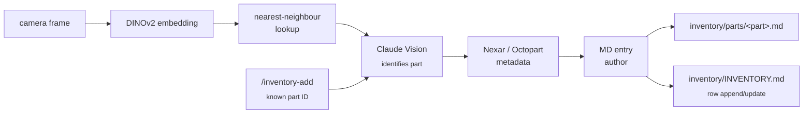
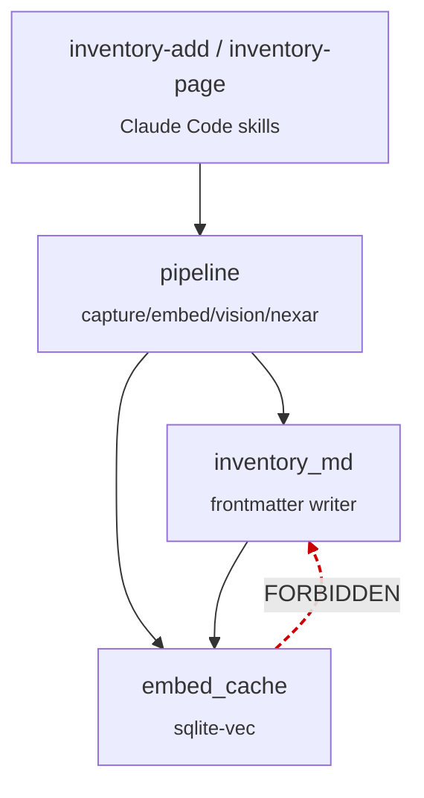

# Architecture

> **Status: concept stage.** The modules below describe the *target*
> architecture; none of the product code exists yet. The pipeline and
> module diagram capture the intent — what gets written, what depends
> on what, and which edges are forbidden — so when implementation
> work begins, the seams are already named.

PartsLedger is the markdown-native inventory companion to the planned
[CircuitSmith](https://github.com/tgd1975/CircuitSmith). The per-piece
design dossiers live in [`../ideas/`](../ideas/OVERVIEW.md) (IDEA-004
through IDEA-009); this doc is the **top-down view** — how the pieces
fit, which invariants hold across them, and where the AI lives.

## What it produces

The only authoritative output is **`inventory/parts/<part>.md`** —
one Markdown file per component, with frontmatter mirroring the
IDEA-027 vocabulary maintained in the
[AwesomeStudioPedal](https://github.com/tgd1975/AwesomeStudioPedal)
repo. A second authored file, `inventory/INVENTORY.md`, is the flat
master index — sectioned tables of `Part | Qty | Description |
Datasheet | Octopart | Notes` rows with links into the per-part
pages.

Supporting artefact (not source of truth):

- **`inventory/.embeddings/vectors.sqlite`** — a DINOv2 embedding
  cache backed by `sqlite-vec`. Regenerable at any time from the
  committed `inventory/parts/*.md` files plus their associated
  images. Never the truth — see "Decoupling seams" below.

Everything else (`inventory/README.md`, the generated indexes under
`docs/developers/tasks/`) is regenerable from the underlying
authored files.

## Pipeline

PartsLedger has two entry paths feeding the same MD-author terminus:
the **camera path** (USB camera frame → vision pipeline) and the
**skill path** (`/inventory-add` invoked with a part ID the LLM
already knows). Both converge on a single MD-entry author that
writes `inventory/parts/<part>.md` and updates `INVENTORY.md`.

The camera path runs left-to-right: capture a frame, embed it with
DINOv2, search the sqlite-vec cache for nearest neighbours, hand the
frame plus the neighbour metadata to Claude Opus 4.7 Vision for
identification, fetch authoritative metadata from Nexar/Octopart, and
write the MD entry. The skill path skips the capture/embedding/KNN
stages and enters the pipeline at the vision step (or directly at
Nexar lookup when the LLM is already confident).

The diagram conventions follow
[`MERMAID_STYLE_GUIDE.md`](MERMAID_STYLE_GUIDE.md): nouns for data
nodes, short verb phrases for processes, `` for the
elaboration.

## Module boundaries

The product code (when it lands) will live under a top-level
`partsledger/` package. The intent is four cohesive modules with
strict one-way edges. The dashed-red edge below is **forbidden**: the
embedding cache must never write to the inventory MDs (the cache is
derived data, the MDs are source of truth).

The forbidden edge sits between `embed_cache` and `inventory_md`:
SQLite is a read-through cache, never a writer. A code path that
updates the cache without a matching MD update would silently drift
the cache away from truth; the MDs would still parse, but a fresh
re-build of the cache from the MDs would diverge from what was on
disk. This is the load-bearing invariant the architecture enforces.

Module-level dependencies:

| Module | Depends on | Purpose |
|---|---|---|
| `cli` (skills) | `pipeline`, `inventory_md` | The two Claude Code skill entry points — `inventory-add` and `inventory-page`. |
| `pipeline` | `inventory_md`, `embed_cache` | Camera capture, DINOv2 embedding, Claude Vision call, Nexar/Octopart fetch, MD-author orchestration. |
| `inventory_md` | (none — leaf) | Reads and writes `inventory/parts/*.md` and `inventory/INVENTORY.md`. Owns the frontmatter schema. |
| `embed_cache` | `inventory_md` (read-only) | DINOv2 vector cache backed by `sqlite-vec`. Reads MD entries to populate; never writes them. |

The forbidden edge surfaces in the codeowner reminder system (see
[`CODE_OWNERS.md`](CODE_OWNERS.md)): any edit to `embed_cache/`
triggers the `co-inventory-schema` skill, which lists the invariant
in its checklist.

## Decoupling seams

The two load-bearing invariants that keep the architecture honest.

### 1. MD files are source of truth; SQLite is cache

The full statement, repeated because it earns the repetition:

- **Source of truth:** `inventory/parts/*.md` and
  `inventory/INVENTORY.md`. Committed to git. Human-readable.
- **Cache:** `inventory/.embeddings/vectors.sqlite`. Gitignored.
  Regenerable.

Regenerating the SQLite from the MDs plus the associated image files
must always be possible — this is the contract that lets us treat
the cache as throwaway state. The day a tooling change makes that
regeneration lossy is the day the contract breaks; that day is also
the day to file an ADR.

**Forbidden edge:** any writer that updates `vectors.sqlite` without
a matching update to the underlying MD entry. The codeowner
reminder system surfaces this invariant on every edit to the
embed_cache module.

### 2. CircuitSmith reads PartsLedger via `--prefer-inventory`

PartsLedger is the canonical inventory store. CircuitSmith (the
schematic-forging companion repo) reads PartsLedger via a documented
read-path — `--prefer-inventory` — to bias schematic generation
towards parts the maker actually has. The arrow is one-way:
**PartsLedger never imports anything from CircuitSmith**.

The contract is the **MD schema** (frontmatter shape per the
IDEA-027 vocabulary in the
[AwesomeStudioPedal](https://github.com/tgd1975/AwesomeStudioPedal)
dossier). PartsLedger is responsible for writing MD entries that
conform; CircuitSmith is responsible for reading them robustly.
Neither side calls the other's code.

This invariant exists for two reasons. First, a circular import
between the two repos would re-create the very coupling that
splitting them was meant to avoid. Second, the MD schema being the
contract means each repo can evolve independently — PartsLedger can
add fields, CircuitSmith can choose whether to consume them, and
breakage shows up as a missing-field warning, not a runtime crash.

## AI containment

PartsLedger uses AI selectively — at authoring time, when a human
is in the loop and approves the result; never at runtime, when an
unattended consumer (CircuitSmith, a future inventory query script,
etc.) reads the MDs.

### Authoring time — yes

- **Claude Opus 4.7 Vision** identifies parts during entry creation
  in the camera path. The vision call sees the camera frame plus
  the K nearest neighbours from the embedding cache; it emits a
  best-guess part ID with a confidence band.
- **Claude (text)** runs the `inventory-add` and `inventory-page`
  skills end-to-end: identifying parts the user describes, writing
  ELI5 prose, formatting frontmatter, hedging when uncertain.
- **DINOv2** is a vision *model* but not an AI in the LLM sense —
  it produces dense embeddings, deterministically, with no
  hallucination surface. It runs in the embedding-cache stage of
  the pipeline.

The user is always the gate. Skills are hedged ("I think this is an
LM358N — confirm?"); the camera path's vision step surfaces
confidence; both write to a temporary draft before committing the
MD entry.

### Runtime — no

- Inventory queries (`cat inventory/INVENTORY.md`,
  `grep "Qty: 0" inventory/parts/`, CircuitSmith's
  `--prefer-inventory` read) hit the MD files directly. No LLM call
  gates these reads.
- The embedding cache is read at authoring time (to populate the
  vision call); it is never read by downstream consumers.

The asymmetry is deliberate. AI-at-authoring-time keeps the entry
quality high (humans confirm; LLMs handle the tedious lookup work).
AI-at-runtime would make every inventory read slow, non-deterministic,
and dependent on a paid API — all of which break the
"grep-able-at-3am" property that justifies the MD format in the
first place.

## Where to go next

| Topic | Doc |
|---|---|
| Style for Python code | [`CODING_STANDARDS.md`](CODING_STANDARDS.md) |
| Test layers and the pytest layout | [`TESTING.md`](TESTING.md) |
| CI workflow inventory and the local mirror | [`CI_PIPELINE.md`](CI_PIPELINE.md) |
| First-time setup walk-through | [`DEVELOPMENT_SETUP.md`](DEVELOPMENT_SETUP.md) |
| IDEA/EPIC/TASK workflow | [`TASK_SYSTEM.md`](TASK_SYSTEM.md) |
| Autonomous-implementation protocol | [`AUTONOMY.md`](AUTONOMY.md) |
| Commit policy and the provenance token | [`COMMIT_POLICY.md`](COMMIT_POLICY.md) |
| Branch protection ruleset | [`BRANCH_PROTECTION_CONCEPT.md`](BRANCH_PROTECTION_CONCEPT.md) |
| Security-review hook layer | [`SECURITY_REVIEW.md`](SECURITY_REVIEW.md) |
| Codeowner reminder mechanism | [`CODE_OWNERS.md`](CODE_OWNERS.md) |
| Mermaid diagram conventions | [`MERMAID_STYLE_GUIDE.md`](MERMAID_STYLE_GUIDE.md) |
| Architecture decision records | [`adr/`](adr/) |
