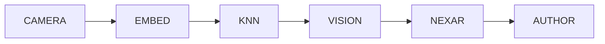

# Mermaid Style Guide

Conventions for mermaid diagrams in PartsLedger's developer docs.
Prescriptive but not restrictive: follow the guide *or* explain in
one line why your diagram needs to deviate.

The first consumer is
[`ARCHITECTURE.md`](ARCHITECTURE.md) — its two diagrams (pipeline
flowchart, module-boundary graph) are the reference examples cited
throughout this doc.

## Pick the right diagram type

| You want to show… | Use | Mermaid keyword |
|---|---|---|
| Data flow / a pipeline | Flowchart, left-to-right | `flowchart LR` |
| Module boundaries / dependency graph | Graph, top-down | `graph TD` |
| Runtime sequence / who calls whom | Sequence diagram | `sequenceDiagram` |
| Lifecycle / state transitions | State diagram v2 | `stateDiagram-v2` |
| Class / type relationships | Class diagram | `classDiagram` |

The pipeline in
[ARCHITECTURE.md § Pipeline](ARCHITECTURE.md#pipeline) is the
reference `flowchart LR`; the module graph in
[ARCHITECTURE.md § Module boundaries](ARCHITECTURE.md#module-boundaries)
is the reference `graph TD`.

If your diagram does not fit any of the above, write the diagram you
need and add a one-line note above it: "Using `gitGraph` because…".

## Palette

Color sparingly. Default to monochrome (mermaid's defaults); reach for
color only when it carries semantic weight.

| Role | Hex | Use for |
|---|---|---|
| Data node | `#dde7ee` (light slate) | Static inputs/outputs (MD entries, JSON, image files). |
| Process node | default | Steps that transform data. Leave uncoloured. |
| Output node | `#d9ead3` (light green) | The thing the pipeline produces and the human looks at. |
| Forbidden edge | `#c00` (red) | An edge the architecture explicitly disallows. Always paired with `stroke-dasharray:5 3`. |
| Conditional edge | default + dotted | Optional or conditional path; use `-.->` rather than colour. |
| Deprecated node | `#ddd` (light grey) | A module marked for removal but still referenced. Add `(deprecated)` to the label. |

Apply with `classDef` and `linkStyle` (see "Edge conventions" for the
forbidden-edge example).

## Edge conventions

| Form | Mermaid syntax | Meaning |
|---|---|---|
| Primary data flow | `A --> B` | Solid arrow, the default. |
| Via / intermediate | `A -. via Y .-> B` (dashed) | The relationship is mediated by `Y`. |
| Optional path | `A -.-> B` (dotted) | May or may not happen, depending on configuration / state. |
| Forbidden | `A -.->` with `\|FORBIDDEN\|` label + red `linkStyle` | Architecture forbids this edge. Always labelled. |
| Bold / primary | `A ==> B` | The "happy path" through a graph with multiple branches. |

The forbidden-edge pattern from
[`ARCHITECTURE.md`](ARCHITECTURE.md#module-boundaries):

```text
EMBED_CACHE -.->|FORBIDDEN| INVENTORY_MD
linkStyle 4 stroke:#c00,stroke-width:2px,stroke-dasharray:5 3
```

(`4` is the zero-indexed position of the edge in the diagram.) The
forbidden edge here captures PartsLedger's load-bearing invariant:
the SQLite embedding cache never writes a part-MD entry; the MD
files are the source of truth.

## Node-label conventions

- **Data nodes**: nouns. `"camera frame"`, `"DINOv2 embedding"`,
  `"part.md"`.
- **Process nodes**: short verb phrases. `"capture frame"`,
  `"identify part"`, `"author MD entry"`.
- **Top-level subsystems**: ALL-CAPS or first-letter-cap, brief.
  `CAMERA`, `EMBED`, `VISION`, `INVENTORY`. Subscripts in HTML `<sub>`
  tags for the one-line annotation.
- **Multi-line labels**: use `<br/>` for the break, `<sub>` for the
  subordinate clause:

  ```text
  VISION["Claude Vision<br/><sub>identifies part<br/>from frame + neighbours</sub>"]
  ```

  Keep the primary label one or two words; push the elaboration into
  the `<sub>`.

## Accessibility — prose summary alongside

Mermaid renders to SVG that is not natively screen-reader-friendly.
**Every mermaid block must have a paragraph of prose either above or
below** that summarises the same information for a reader who cannot
see the diagram.

````markdown
The pipeline runs left-to-right: camera frame → DINOv2 embedding →
nearest-neighbour lookup → Claude Vision identification →
Nexar/Octopart metadata fetch → MD entry author. The skill-path
(`inventory-add` invoked with a known part) skips the first three
steps and converges at "MD entry author".


````

The prose is canonical; the diagram is the picture-accelerator. If
the two disagree, fix the diagram.

## Length and density

A single diagram should fit in one screen height (~30 visible nodes
maximum). If you need more, split into two diagrams with one
shared-node ("Continued in `diagram B`…") rather than dense.

Avoid `subgraph` nesting deeper than one level — it obscures more
than it clarifies.

## Mermaid features to avoid

- **Themes / `themeVariables`.** They look different on GitHub vs.
  local renderers and don't survive PR review consistently. Use the
  default theme plus `classDef` for semantic colour.
- **`%%{init: …}%%` directives.** Same reason — non-portable.
- **Animations and click handlers.** This is documentation, not a
  microsite.

## Updating this guide

If you write a diagram and need a convention this guide doesn't
cover, extend the guide as part of the same commit that lands the
new diagram. New conventions are cheap; surprise readers later are
expensive.
