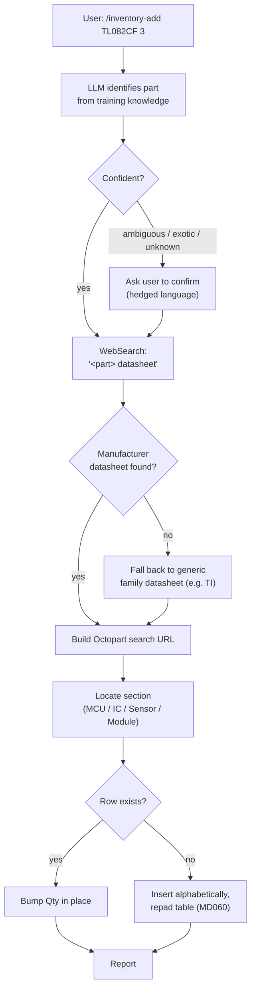

## Archive Reason

2026-05-14 — Promoted to EPIC-003 (skill-path-today), tasks TASK-019..TASK-021.

> *Replaces the "Skill Path" + "Sincere-Language Convention" sections of
> the retired IDEA-001 dossier.* These two skills are the **today**-tooling
> — already in production use, no hardware needed beyond a keyboard. They
> are also the reference behaviour the camera path
> ([IDEA-006](idea-006-usb-camera-capture.md) → [IDEA-008](idea-008-metadata-enrichment.md))
> must match when it produces the same on-disk shape.

## Status

✅ **In use.** The two skills live in
[`.claude/skills/inventory-add/`](../../../../.claude/skills/inventory-add/)
and
[`.claude/skills/inventory-page/`](../../../../.claude/skills/inventory-page/).
The six pages under [`inventory/parts/`](../../../../inventory/parts/)
were produced by this path.

## Why this idea, not just "read the SKILL.md"

The SKILL.md files are the runtime spec — what Claude does when invoked.
This dossier is the **honable** view: the trade-offs that went into the
flow, the open questions about the flow, the things the camera path
must replicate. The SKILL.md prompts can drift to match decisions made
here.

## `/inventory-add <part-id> <qty>` (also batched: `…, <part-id> <qty>`)

### Specials

- **Bulk / kits** — generic classes (assorted `1N4148`, carbon-film
  resistor set) skip the row workflow and go to the **Bulk / kits**
  section as a bullet entry. We don't catalogue individual values.
- **Hedge language is mandatory.** *"Likely the X from Y"*, never
  *"is X"*. The user is ground truth; the LLM is a guess until they
  confirm. Enforced by phrasing rules inside the skill prompt.
- **Package assumption.** The maker's drawer is through-hole. Function
  descriptions never claim a SOIC variant even when the marking suggests
  it — the physical part on the bench is the ground truth, the marking
  is a hint.
- **Batching.** A single invocation can pass multiple `<part> <qty>`
  pairs separated by commas; the skill walks them sequentially so each
  identification stays auditable.

## `/inventory-page <part-id>`

Generates a one-page reference for a part that's already in
`INVENTORY.md`, then re-links the Part cell to it. The page structure is
defined by the schema dossier — see
[IDEA-004 § `parts/<id>.md`](idea-004-markdown-inventory-schema.md#partsidmd--the-optional-reference-page).

Key constraints the skill enforces:

- **Prose, not schema.** The page reads like a maker's notebook —
  metaphors, gotchas, sample circuit as a connection list. Frontmatter
  is intentionally absent on the page; the parts pages stay prose-only
  by design — IDEA-004 has explicitly closed out the "add a
  machine-readable block" alternative
  ([IDEA-004 § Out of scope](idea-004-markdown-inventory-schema.md#out-of-scope-decided)).
- **No invented links.** Datasheet and Octopart URLs are reused from
  `INVENTORY.md`, never re-fetched or guessed.
- **ASCII pinout walls must align.** The DIP-N top-view diagram is
  rendered with a strict character budget; an off-by-one breaks the
  visual.
- **Family pages.** When two `INVENTORY.md` rows are revisions of the
  same chip, the skill produces a single shared page (filename = canonical
  variant) and updates both rows' Notes cells with *"Shares page with
  …"*. See [IDEA-004 § Family pages](idea-004-markdown-inventory-schema.md#family-pages).

### Planned — auto-trigger on row creation

Today `/inventory-page` is explicit: the maker invokes it. The
decision in
[IDEA-008 § Page-generation trigger](idea-008-metadata-enrichment.md#open-questions-to-hone)
chains it onto every row-creation event:

- **`/inventory-add` (skill path)** — after a new row lands,
  `/inventory-page` runs **synchronously** as the next step.
- **Camera path** ([IDEA-006](idea-006-usb-camera-capture.md) →
  [IDEA-007](idea-007-visual-recognition-dinov2-vlm.md) →
  [IDEA-008](idea-008-metadata-enrichment.md)) — after enrichment
  completes, page generation runs **async background** so the
  capture loop's silent-qty++ promise stays intact.

The page generator itself doesn't change shape — what changes is
*who calls it* and *with which preloaded metadata* (the
IDEA-008 response cache supplies datasheet URL, description,
package, manufacturer, so the LLM skips the WebSearch dance).

The matching execution-plan stage is
[Stage 3 — Page-generation auto-trigger on row creation](#stage-3--page-generation-auto-trigger-on-row-creation)
below; trigger semantics live where the skill lives, not buried in
IDEA-008.

## The sincere-language convention

Both skills share one phrasing rule: **hedge identifications, mark
estimates as estimates, never use `must / always / never` as rhetorical
emphasis.**

- The component on the bench is the ground truth.
- The LLM (or a future VLM) is a guess until the maker confirms.
- *"At a glance"* specs in `parts/*.md` use `~`, `up to`, `typically`
  rather than absolute claims.
- The camera path ([IDEA-007](idea-007-visual-recognition-dinov2-vlm.md))
  inherits this rule unchanged when it lands.

This is enforced inside the skills' prompts (phrasing patterns in
`inventory-add`, qualifying language in `inventory-page`) and is also a
project-wide convention surfaced by the
[`co-inventory-master-index`](../../../../.claude/skills/co-inventory-master-index/SKILL.md)
and
[`co-inventory-schema`](../../../../.claude/skills/co-inventory-schema/SKILL.md)
codeowner skills.

## What we build vs. what we use

| Component | Source | Status |
|---|---|---|
| `/inventory-add` skill | This repo, `.claude/skills/inventory-add/` | ✅ in use |
| `/inventory-page` skill | This repo, `.claude/skills/inventory-page/` | ✅ in use |
| Datasheet lookup | `WebSearch` tool | ✅ in use |
| Markdown writer + table padding | Inside the skills themselves | ✅ in use |

No hardware. No external services beyond `WebSearch`. The whole path runs
inside the Claude Code session.

## Execution plan

Two pieces of work fall out of this dossier; the rest of the skill
path is already in production. The stages are independent. Other
changes to the same two skills land via
[IDEA-004's execution plan](idea-004-markdown-inventory-schema.md#execution-plan)
— see "Out of scope for this rollout" below.

### Stage 1 — Hedge-language lint

**Goal.** Mechanical backstop for the
[sincere-language convention](#the-sincere-language-convention)
above. Prompt-example enforcement drifts; lint doesn't. Flags
rhetorical-emphasis uses of `is the` / `must` / `always` / `never`
in `inventory/parts/*.md`.

**Scope — parts pages only.** The lint walks
`inventory/parts/*.md` and **not** `INVENTORY.md`. Two reasons:
the master index's Notes cells are short, hand-curated by the
maker, and frequently quote datasheet language verbatim — a
table-cell lint would generate mostly noise; and the convention's
real failure mode is long-form prose drift inside parts pages,
which is what the lint is sized for. If the Notes column ever
starts attracting LLM-authored hedge violations in practice, a
narrower row-level lint can be added then.

**Changes:**

1. **Lint script under `scripts/`** — Python script that walks
   `inventory/parts/*.md` and flags banned literals outside exempt
   contexts (fenced code blocks, ASCII-pinout blocks, quoted
   datasheet excerpts). Inline `<!-- lint: ok -->` marker overrides
   on a specific line when a phrase is intentional.
2. **Pre-commit hook integration.** Add a stanza to
   `scripts/pre-commit` so the lint fires on every commit touching
   `inventory/parts/*.md`. Same gate shape as the existing
   markdownlint stanza.
3. **CHANGELOG.md** — one bullet under `[Unreleased] / ### Tooling`,
   per CLAUDE.md *CHANGELOG updates ride with the merge*.

**Validation:**

- The six existing parts pages pass clean (any failures are real
  finds, not lint false positives).
- A synthetic *"this is the LM358"* outside a code block fails.
- *"walls must align"* inside an ASCII-pinout block passes
  (exempt-context works).
- A synthetic *"is the LM358"* inside an `INVENTORY.md` Notes
  cell passes (scope is parts pages only — by design).

**Dependencies.** None *within this dossier*. Cross-dossier:
this stage assumes IDEA-004 Stage 1 has already shipped (so the
parts-page set the lint walks is the post-schema-update set, not
mid-migration). The two changes don't conflict, but landing them
out of order would force a re-run of the lint against pages that
the schema update is about to rewrite anyway.

### Stage 2 — Family-page proactive suggestion

**Goal.** Detect MPN-stem siblings at add-time / page-generation
time so the maker doesn't accidentally create two unconnected pages
(or two unmerged rows) for what's really the same chip. Advisory
only — same maker-discretion principle as the splitting suggestion
in IDEA-004: the suggestion fires, the maker decides.

**Touchpoints:**

- **`/inventory-add <new-mpn> <qty>`** — after locating the
  section, scan existing rows. If any shares an MPN base with the
  new entry (e.g. adding `LM358P` while `LM358N` is already in the
  inventory), offer the family-page pattern: mark both rows' Notes
  with the *"Shares page with …"* breadcrumb per
  [IDEA-004 § Family pages](idea-004-markdown-inventory-schema.md#family-pages),
  and generate the family page now or defer.
- **`/inventory-page <mpn>`** — before generating a fresh page,
  check whether a stem-sibling already has one. If so, propose
  *"join the existing `<sibling>.md` as a family page"* rather
  than creating a new file.

**Heuristic.** Stem match has two conjunctive parts:

1. **Length gate** — common prefix is at least 4 alphanumeric
   characters. Drops `LM358` vs `LM2904` (shared prefix `LM`, 2
   chars) and `LM358N` vs `LM386N` (shared prefix `LM3`, 3
   chars).
2. **Suffix-only divergence** — once the common prefix is
   stripped, the remainders are pure package/grade suffixes
   (single letter, optional digit, optional trailing letter), not
   further alphanumeric stems. Drops `LM358` vs `LM3580` (the
   remainder `0` is part of a different stem, not a suffix).

Both must hold. The
[IDEA-004 family-boundary worked examples](idea-004-markdown-inventory-schema.md#family-pages)
are the ground truth — if the regex disagrees with them, the
examples win and the regex gets tightened. Conservative beats
generous: fewer false positives means the maker takes real
suggestions seriously when they fire.

**Batched-add case.** `/inventory-add` accepts comma-separated
`<part> <qty>` pairs. If `LM358P 2, LM358N 3` arrives in one
invocation with neither in the inventory yet, the scan runs
against the **post-commit** state after each pair — so the
second pair sees the first as an existing row and the
family-suggestion fires at that point. Accepting it during the
batch produces the same end state as adding the two parts in
separate invocations and then accepting the suggestion. Declining
the second pair's suggestion leaves both rows present without
cross-links. No retroactive prompt fires after the batch
completes — the maker's decision per pair is final for that
invocation.

**Changes:**

1. **`/inventory-add` skill** — add the stem-sibling scan + the
   advisory prompt. The scan runs against committed-so-far state
   within a batch, per the rule above. On decline, the new row
   lands without any Notes cross-link.
2. **`/inventory-page` skill** — add the existing-sibling-page
   check + the family-join prompt. On decline, generate a fresh
   page as today.
3. **CHANGELOG.md** — one bullet under
   `[Unreleased] / ### Tooling`.

**Validation:**

- Adding `LM358P` while `LM358N` is already a row fires the
  suggestion; accepting it updates both Notes cells and produces
  a single family page.
- Adding `LM2904` while `LM358` exists does **not** fire the
  suggestion (IDEA-004's ❌ examples must stay ❌).
- Adding `LM358N` while `LM386N` exists does **not** fire either
  (common prefix `LM3` is below the 4-character threshold).
- Batched `/inventory-add LM358P 2, LM358N 3` against an empty
  inventory: first pair commits silently, second pair fires the
  suggestion against the just-committed first pair.
- A maker who declines and proceeds gets a clean fresh row /
  fresh page — no artefacts.

**Dependencies.** None *within this dossier*; independent of
Stage 1. Cross-dossier: assumes IDEA-004 Stage 1 has shipped (the
sibling scan reads rows from the post-`Source`-column schema; the
family-page write path reuses the Notes-cell breadcrumb pattern
that lands in IDEA-004 Stage 1).

### Stage 3 — Page-generation auto-trigger on row creation

**Goal.** Wire `/inventory-add` to chain into enrichment and
`/inventory-page` automatically for new rows, so a maker-typed
`/inventory-add LM358N 5` lands a row **and** a reference page
in one invocation. Today the maker has to invoke
`/inventory-page` by hand. The design lives in
[§ Planned — auto-trigger on row creation](#planned--auto-trigger-on-row-creation)
above; this stage is the execution-plan slot the design has
been waiting for.

**Trigger semantics — new rows only.** A qty++ on an existing
row does not re-run page-gen — the page either already exists
(the maker visited the part before) or the maker declined it
once and re-prompting on every restock would nag. New-row
detection is the same signal `/inventory-add` already computes
when it decides between *insert alphabetically* and *bump qty
in place* (the **J** branch in the skill's flowchart). On a
new row, the chain fires; on a bumped row, it doesn't.

**Changes:**

1. **`/inventory-add` skill** — after a new row commits, invoke
   `enrich(part_id)` from
   [IDEA-008 Stage 6](idea-008-metadata-enrichment.md#stage-6--skill-path-sync-invocation--page-generation-chain)
   **synchronously**. The skill blocks on the result; the maker
   is already in an LLM dialogue, so the extra wait is in the
   same budget as the WebSearch dance the skill runs today.
   Enrichment populates the row's Datasheet / Octopart /
   Description / Notes cells from the IDEA-008 response cache,
   so by the time page-gen runs the LLM has structured metadata
   in hand and skips its own WebSearch.
2. **Chain into `/inventory-page <part-id>`** — the same skill
   invocation. The page generator reuses the enriched cells
   verbatim per
   [§ `/inventory-page` § Key constraints](#inventory-page-part-id)
   *no invented links*. On the rare failure (page-gen errors
   out, LLM declines to write), the row stays committed — the
   row write is the load-bearing artefact, page-gen is
   convenience.
3. **Batched-add behaviour.** When `/inventory-add` accepts
   multiple comma-separated `<part> <qty>` pairs, the chain
   runs **once per new-row pair** in sequence. Order matches
   the batch order so each part's audit trail stays clean.
4. **Maker override.** A `--no-page` (or equivalent prompt-time
   intent) skips the page-gen step but still runs enrichment.
   Edge case for makers seeding a row from a kit without
   wanting an immediate reference page. Default behaviour:
   chain fires, no override needed.
5. **`CHANGELOG.md`** — one bullet under
   `[Unreleased] / ### Tooling`.

**Validation:**

- `/inventory-add LM358N 5` against an empty inventory commits
  the row, runs enrichment (Datasheet / Description filled
  from Nexar or family fallback), generates
  `inventory/parts/lm358n.md`, and re-links the row's Part cell
  to it — all in one invocation.
- `/inventory-add LM358N 3` against an inventory where the row
  already exists bumps qty in place and **does not** re-run
  enrichment or page-gen.
- Batched `/inventory-add LM358N 5, TL082CP 2` against an
  empty inventory commits two rows and produces two pages
  (`lm358n.md`, `tl082.md`, the latter as a family page if
  TL082CF is already in the inventory per
  [IDEA-004 § Family pages](idea-004-markdown-inventory-schema.md#family-pages)).
- A page-gen failure on row N of a batch does not block rows
  N+1, N+2, … — each pair is independent.
- The camera path is untouched. This stage is skill-path only;
  the camera path's async dispatch lives in
  [IDEA-008 Stage 5](idea-008-metadata-enrichment.md#stage-5--camera-path-async-dispatch).

**Dependencies.** Sequenced after
[IDEA-008 Stages 1–4](idea-008-metadata-enrichment.md#execution-plan)
(the enrichment orchestrator must exist for the chain to call
into) and
[IDEA-008 Stage 6](idea-008-metadata-enrichment.md#stage-6--skill-path-sync-invocation--page-generation-chain)
(the sync-invocation wiring on IDEA-008's side that this stage
is the IDEA-005 half of). Stage 1 and Stage 2 of this dossier
are unaffected; the family-page-proactive-suggestion logic
from Stage 2 fires before this chain when both apply (i.e. the
maker first sees the *"share a page with …"* prompt and then
the chain proceeds against the resolved decision).

### Out of scope for this rollout

The schema-driven updates that touch the same two skills land
through [IDEA-004's execution plan](idea-004-markdown-inventory-schema.md#execution-plan),
not through this dossier:

- **`Source: manual` column writing** (`/inventory-add`) and the
  **section-flex behaviour** (enumerate sections from the file
  when populated, fall back to the default list only when empty)
  — both land in IDEA-004 Stage 1.
- **Part-class-adaptive Pinout / Sample-circuit / ELI5 sections**
  (`/inventory-page`) — lands in IDEA-004 Stage 2.

The sequencing constraint (IDEA-004 Stage 1 first) lives in the
per-stage **Dependencies** lines above; what's listed here is
just which feature belongs to which dossier so honing changes
land in the right file.

## Out of scope (decided)

Items considered and explicitly rejected, recorded here so they
don't get re-litigated.

- **Confidence-aware revisit.** Not added as a `Confirmed: no` flag
  or a separate review section. Same principle as
  [IDEA-004's confidence policy](idea-004-markdown-inventory-schema.md#inventorymd--the-flat-index):
  the LLM either commits a row (confident enough) or asks the maker
  to confirm before committing — the *"Confident?"* branch in the
  flowchart above already encodes this. There is no third
  *"committed but unconfirmed"* state. Specific doubts the LLM
  wants to flag once a row is committed go in Notes as a one-line
  hedge, not as a structured *"to confirm"* axis that would rot.
- **Provenance tagging via `git blame`.** Resolved by IDEA-004's
  `Source` column — every row carries `manual` or `camera` per the
  row-level rules. KISS: the column is the answer; `git blame` is
  not needed.
- **Headless / plain-text mode.** Not built. The intended interface
  is VS Code + the skill system; an ssh-from-workshop user has to
  use the same setup. A separate `pl inv-add` CLI would duplicate
  the prompt logic and immediately drift from it. A maker who
  genuinely needs a non-skill workflow knows what they're choosing.
- **Multi-tenant kits — promotion rule.** Resolved: bulk entries
  answer *"do we have any?"*, not *"how many of which value?"*.
  Kits stay as bullets in the Bulk / kits section. If the maker
  decides a specific value inside a kit deserves its own tracking
  (e.g. *"the red 5 mm LEDs"*), they promote it to a row by hand
  — same maker-discretion principle as section taxonomy. No
  tooling rule decides when promotion happens.

## Related

- [IDEA-004](idea-004-markdown-inventory-schema.md) — the on-disk shape
  this skill writes.
- [IDEA-006](idea-006-usb-camera-capture.md) — the future hardware
  front-door whose output has to plug into the same writer.
- [IDEA-007](idea-007-visual-recognition-dinov2-vlm.md) — the camera-path
  recognition that produces the same row shape this skill produces by
  hand.
- [IDEA-003](idea-003-external-inventory-tool-integration.md) — the
  InvenTree bridge, which would seed this skill with rows it didn't
  type itself.
