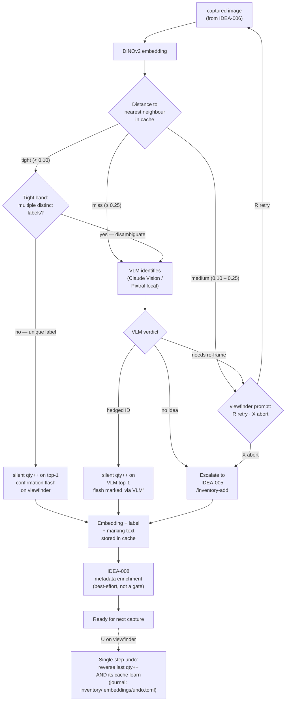

## Archive Reason

2026-05-14 — Promoted to EPIC-006 (visual-recognition), tasks TASK-039..TASK-044.

> *Replaces the camera-path "DINOv2 + VLM" stages from the retired
> IDEA-001 dossier.* The most interesting unsolved piece of PartsLedger
> — and the one whose architecture decisions cascade through the rest of
> the camera path.

## Status

⏳ **Planned.** Neither stage is implemented. The vector cache directory
(`inventory/.embeddings/vectors.sqlite`) is named in the schema dossier
([IDEA-004](idea-004-markdown-inventory-schema.md#directory-layout)) but
holds no data yet.

## Why the two stages stay in one idea

DINOv2 cache and VLM identification *could* be split into separate
dossiers, but operationally they are one decision. The cache is only
useful because of its fallback to the VLM; the VLM is only affordable
because of the cache. Tuning one without the other doesn't make sense.

## Architecture discussion — why both a vector cache and a VLM

Honest answer to *"what does the vector DB actually bring?"* — and
why neither half of the combo can be dropped without losing the
other half's value. Surfaced during the 2026-05-13 hone after the
question came up bluntly. The summary lives here so future passes
don't relitigate ground that's already been walked.

### What DINOv2 alone can and can't do

DINOv2 is a self-supervised Vision Transformer trained on natural
imagery. Strong at *visual similarity*; not at *reading text*. For
the bastelkiste workflow:

| Part type | DINOv2 cache helps? |
|---|---|
| Modules with distinctive form (HC-SR04, BME280 breakout, ESP32 dev-kits) | **Yes** — shape is discriminative. |
| TO-220 regulators, distinctive power transistors | **Yes** — form + rough marking position usually enough. |
| LEDs by colour, sensors with characteristic shape | **Yes**, as long as the form varies. |
| Resistors *between values* | **No** — the discriminator is the colour-band sequence, a few pixels wide. |
| Capacitors by value | **No** — same reason. |
| ICs in the same package (LM358 vs TL082, both DIP-8) | **No** — the discriminator *is* the marking text. DINOv2 reads no text. |

Roughly: the cache disambiguates *form*. About 70 % of common
bastelkiste parts (passives + standard-package ICs) are not
form-discriminated; their distinguishing feature is **the
identifying surface on the part body** — marking text on a DIP
or TO-220, the colour-band sequence on a through-hole resistor.
The VLM exists in this dossier specifically because it reads
that surface, in both variants: the same vision call that
disambiguates LM358N from LM358P off a DIP-8 also reads "yellow
violet red gold" off a 4k7 5% resistor. No separate OCR stage,
no `pytesseract` / `paddleocr` dependency — the OCR debate was
closed in [IDEA-008](idea-008-metadata-enrichment.md#open-questions-to-hone)
2026-05-14.

### Three framings considered

| Framing | What it means | Why rejected (where rejected) |
|---|---|---|
| **A) Cache + VLM** *(chosen)* | DINOv2 triages, VLM disambiguates on miss. The cache covers form-distinct parts cheaply; the VLM covers everything else. | Kept — see *Why A* below. |
| **B) VLM-only, no cache** | Every capture goes to the VLM. No sqlite-vec, no embedding cache. | Slower per capture, full network dependency, no offline path, no improvement-with-use. The cache is cheap; removing it removes value. |
| **C) Cache-only, no VLM** | Drop the VLM entirely. Cache learns only from manual entries via [`/inventory-add`](idea-005-skill-path-today.md). | Loses the ~70 % of parts where marking text is the discriminator. The cache becomes a *form* classifier, not an identification system. Camera path then helps with ~30 % of parts. |

A fourth framing — *drop the camera path entirely; rely on
[`/inventory-add`](idea-005-skill-path-today.md) alone* — was raised
during the hone but is **not part of this idea's scope**. It's a
sibling decision about the whole camera-path investment (IDEA-006 +
007 + 008 together) and gets re-opened if and when routine use shows
the camera path losing to manual entry on time-to-add.

### Why A — cache + VLM — was kept

The cache and the VLM compensate for each other's blind spots:

- The cache is fast and free *when it works* (form-distinct parts).
  Without it, every capture pays a VLM API call — cost + latency +
  network dependency. With it, the bastelkiste's repeat-sighting
  pattern becomes a near-zero-cost identification.
- The VLM reads marking text *when the cache cannot*. Without it,
  the cache reduces to a coarse-form classifier — fine for modules,
  useless for the ~70 % of parts where shape doesn't discriminate.

Neither half is sufficient alone. Together they bracket the
identification surface: cache covers visual *similarity*, VLM covers
visual *reading*. The build cost lives in
[What we build vs. what we use](#what-we-build-vs-what-we-use); the
saving is the per-capture VLM-API spend on repeats.

### Pre-conditions that would re-open this discussion

The argument above rests on a few stable assumptions. If any of them
changes, this section deserves a re-read:

- The maker's bastelkiste continues to skew through-hole / DIP /
  module parts, where marking text is the dominant discriminator.
- A capable VLM remains available either as a hosted API (Claude
  Vision) or self-hosted (Pixtral). If both pricing or licensing
  paths break, Framing C becomes the better answer.
- Repeat-capture frequency stays high enough for the cache hit rate
  to matter. If the bastelkiste churns parts faster than embeddings
  accumulate, the cache pays no dividend and Framing B becomes the
  better answer.

## The recognition pipeline

One pipeline diagram, three pipeline microdecisions, the re-frame
loop integrated as an edge rather than a separate flow:



### Three pipeline microdecisions (2026-05-13 hone)

- **Tight cache hit ⇒ silent write — unless the tight band is
  ambiguous.** No confirmation prompt on the common case. The
  brief confirmation flash on the viewfinder (see
  [IDEA-006 § Overlays during recognition](idea-006-usb-camera-capture.md#overlays-during-recognition))
  *is* the surface the maker reads. If the flash names the wrong
  part, the maker presses **`U`** within the next few captures and
  the write is reversed. The dossier previously demanded an
  explicit *"User confirms via TUI"* step — that's gone.
  **Refinement (marking-text bias, honed 2026-05-13):** when the
  tight-distance neighbourhood in the cache holds *more than one
  distinct label* (the classic LM358N vs LM358P collision —
  visually near-identical DIP-8s that differ by a single character
  on the body), the hit is reclassified as ambiguous and escalated
  to the VLM for marking-text disambiguation, exactly as in the
  miss path. The cache implicitly learns which neighbourhoods need
  this disambiguation by accumulating multi-label rows there over
  time. No OCR dependency: the VLM already reads marking text as
  part of its normal verdict.
- **Medium distance or VLM *needs-re-frame* ⇒ retry or abort, never
  auto-pick.** The dossier previously had a *"top-3 picker in TUI"*
  mid-confidence branch — also gone. The viewfinder shows two
  actions: **R** to re-shoot (same part, hopefully better angle /
  lighting), **X** to abort and fall back to manual entry via
  [`/inventory-add`](idea-005-skill-path-today.md). Cap at two
  retries per part before the abort path triggers automatically.
- **Single-step undo on `U`.** Reverses the last write — both the
  `qty++` in the part MD *and* the embedding+label that just
  landed in the cache. Without the cache half, a wrong silent
  write would poison the cache for every future capture in that
  neighbourhood. Single step only; longer history is a polish, not
  a primitive.

### Capture contract — one object per photo

**Design decision** (2026-05-13 hone):

A captured image is contracted to show **exactly one part**.
Multi-object frames are an explicit non-goal — the pipeline does
not segment, does not count, does not batch.

The three multi-object sub-scenarios and how the pipeline handles
each:

- **Accidental multi-object** — two parts in shot when the maker
  intended one. Falls through the standard re-frame loop: DINOv2
  fails to match cleanly, VLM (on miss) returns *needs re-frame*
  with the *"two parts in shot — show one"* hint (one of the seven
  hint families). The maker pushes the second part aside and
  re-shoots. No new code needed.
- **Intentional batch — multiple identical parts** (five fresh
  4k7 resistors). The maker re-shoots **one at a time**, one
  qty++ per capture. No `qty += N` modifier, no VLM-driven count,
  no batch mode. The cognitive cost of mode-switching (*"am I in
  single or batch mode right now?"*) is exactly what KISS forbids.
- **Intentional multi-object — mixed parts** (a poured-out bag).
  Same answer: one at a time, hand-eye, viewfinder stays open
  across the session.

The contract simplifies several otherwise-thorny things at once:

- DINOv2 cache entries always describe one part, not a scene.
- VLM prompts never have to disambiguate *"which of the three
  parts in this image do you mean?"*.
- The verdict payload (verdict enum, top-1 candidate, hint, …)
  never has to grow a per-object index.
- Undo (`U`) is unambiguous — there is only one part to reverse.

### Where the VLM still earns its keep

The cache cannot identify a part it has never seen, and it cannot
read marking text. On *miss* (distance ≥ 0.25), the VLM runs once
and returns one of three structured verdicts:

- **Hedged ID** (*"likely the L7805CV, voltage regulator, TO-220-3"*)
  — silently written like a tight cache hit, but the confirmation
  flash is marked *"via VLM"* so the maker knows to be marginally
  more skeptical.
- **Needs re-frame** (image too blurry, marking unreadable, two
  parts in shot, hand visible) — routed back into the
  *retry-or-abort* prompt. The hint string the VLM emits surfaces
  as a viewfinder overlay (*"rotate 90°"*, *"more from the left"*).
- **No idea** — genuine cold-start with nothing similar in the
  cache and the marking unreadable. Hands off straight to manual
  escalation, no retry. Resists wasting the maker's time on a
  part the VLM has already conceded.

## Stage 1 — DINOv2 as similarity cache

The crucial framing: **DINOv2 is not a classifier**. It produces a 768-D
embedding per image; classification is `argmin(distance)` over the
labelled embeddings already in the cache.

Implications:

- **No training session.** A part's first sighting goes through the VLM
  (or manual `/inventory-add` entry) and lands in the cache. Subsequent
  sightings of the same part-type match the cache directly. After 3–5
  photos per part, recognition is effectively free.
- **Active-learning loop, silent variant.** Every silent write —
  tight cache hit, VLM hit, or manual `/inventory-add` entry —
  contributes its embedding **plus label plus VLM-read marking
  text (when one was read)** to the cache. The marking-text column
  is what lets the
  [tight-band ambiguity refinement](#the-recognition-pipeline)
  above detect the LM358N-vs-LM358P collision without re-reading
  the image. Misidentifications caught by the maker via **`U`** delete
  the offending row in the same transaction. No negative-example
  signal is stored: the bad row is gone, not marked-bad.
- **No retraining.** The DINOv2 backbone is frozen. The "learning" is
  the growing cache, nothing else.

### Backbone

`facebookresearch/dinov2` via `torch.hub`. The ViT-S/14 variant is the
sweet spot — 21M params, runs on CPU at ~200 ms/image, on a consumer
GPU at < 20 ms.

First invocation pulls ~80 MB of weights from PyTorch Hub into
`~/.cache/torch/hub/`; the *fully offline* story for this download
lives in [IDEA-010 § Embedding backbone hosting](idea-010-local-vlm-hosting.md#embedding-backbone-hosting)
alongside the VLM-local-hosting story.

### Vector DB

Two candidates:

- **`sqlite-vec`** *(preferred)*. SQLite extension, file-based, ships
  next to the inventory's other artefacts. Aligns with the
  MD-as-source-of-truth ethos: the cache is one extra file in
  `inventory/.embeddings/`, regenerable from images + MDs.
- **FAISS**. Battle-tested, faster at scale, but a heavier dependency
  and no native SQL story. Worth it only if `sqlite-vec` becomes a
  bottleneck — unlikely at hobbyist scale (< 10k parts).

## Stage 2 — VLM identification

Runs only on **miss** (DINOv2 distance ≥ 0.25), or when the maker
explicitly asks for a "second opinion" — see open questions. Reads
the image, optionally also reads the nearest cache neighbours as a
prompt-side hint, and emits one of three structured verdicts:

- **Hedged ID** — `likely the L7805CV, voltage regulator, TO-220-3`.
  Silently written; flash marked *"via VLM"*.
- **Needs re-frame** — short hint string for the human, drawn from
  one of seven families the VLM is good at diagnosing: angle /
  orientation (*"rotate 90°"*, *"show more from the left"*),
  lighting (*"too dark"*, *"glare on the marking"*), sharpness
  (*"image too blurry"*), framing (*"part is off-centre"*,
  *"two parts in shot"*), surface / background (*"reflective
  surface"*), distance (*"too close"*), marking state (*"marking
  worn — try a different side"*). See
  [IDEA-006 § Recognition-state hints](idea-006-usb-camera-capture.md#recognition-state-hints)
  for the full family table that IDEA-006 renders against. Routed
  back through the *retry-or-abort* prompt, not auto-retried.
- **No idea** — cache is empty in this neighbourhood and the marking
  is unreadable. Hands off to manual escalation. The pipeline does
  not try again on the same part.

### VLM choice

Two- (or *n*-) dimensional matrix. **Where** the VLM runs is a
deployment decision owned by
[IDEA-010](idea-010-local-vlm-hosting.md); **which** VLM weights are
on the other end of `$PL_VLM_BASE_URL` is what this section is about:

| VLM | Local | Hosted | Notes |
|---|---|---|---|
| **Claude Opus 4.7 Vision** | — *(proprietary, no local option)* | Anthropic API | Strongest at reading marking text. `$PL_VLM_BASE_URL=https://api.anthropic.com/v1`, `$PL_VLM_API_KEY=$ANTHROPIC_API_KEY`. |
| **Pixtral 12B** | Ollama / `vllm` / `llama.cpp` (see [IDEA-010](idea-010-local-vlm-hosting.md)) | Mistral La Plateforme, Together AI, Fireworks, OpenRouter | Apache 2.0 model weights, marking-text reader on par with Claude. |
| **LLaVA-NeXT, Qwen-VL, others** | Ollama / `vllm` | Various aggregators | Future options; details in [IDEA-010 § Model choices](idea-010-local-vlm-hosting.md#model-choices). |

PartsLedger does **not** ship a hardcoded list of supported VLMs. The
adapter in [VLM interfacing](#vlm-interfacing--one-openai-compatible-rest-adapter)
below speaks OpenAI-compatible REST to whatever endpoint
`$PL_VLM_BASE_URL` points at; "supported" means "the endpoint reads
the image and returns a JSON verdict in our schema".

## VLM interfacing — one OpenAI-compatible REST adapter

**One transport for every VLM, hosted or local.** The adapter
PartsLedger maintains speaks OpenAI-compatible `/v1/chat/completions`
to whatever endpoint `$PL_VLM_BASE_URL` resolves to. Anthropic, the
Mistral API, Ollama, `vllm`, OpenRouter, Together, Fireworks — all
speak this. PartsLedger never imports a vendor-specific SDK.

### Maker-facing config

```bash
# Default — Claude Opus 4.7 Vision hosted
export PL_VLM_BASE_URL="https://api.anthropic.com/v1"
export PL_VLM_MODEL="claude-opus-4-7"
export PL_VLM_API_KEY="$ANTHROPIC_API_KEY"

# Local Pixtral via Ollama (see IDEA-010 for the install side)
export PL_VLM_BASE_URL="http://localhost:11434/v1"
export PL_VLM_MODEL="pixtral"
# No PL_VLM_API_KEY needed

# Hosted Pixtral via Mistral
export PL_VLM_BASE_URL="https://api.mistral.ai/v1"
export PL_VLM_MODEL="pixtral-12b-2409"
export PL_VLM_API_KEY="$PL_MISTRAL_KEY"
```

Switching between hosted and local is **purely env-var-driven**.
PartsLedger sees three env vars; everything else is the provider's
job. No conditional code paths per provider, no per-vendor SDK
dependency tree.

### Why Pattern A and not a per-provider SDK matrix

Three patterns were considered during the 2026-05-13 hone:

| Pattern | Trade-off | Verdict |
|---|---|---|
| **A — OpenAI-compatible REST everywhere** *(chosen)* | One adapter; provider swap is env-var only; no SDK lock-in. Vendor-specific features (Anthropic prompt caching, native JSON-schema modes) need polite fallbacks. | Kept — KISS dominates feature delta for this workload. |
| **B — Per-provider native SDK** | Best feature depth per provider (caching, structured outputs). Three+ SDKs as dependencies; large maintenance surface. | Rejected — feature gains don't justify the dep tree. |
| **C — A wrapper library (LiteLLM and friends)** | One Python interface to many providers. Adds a third-party dep with its own abstraction risk; opinionated about call shape. | Rejected — same one-adapter goal as A, but with extra abstraction we don't control. |

### Secrets handling

`$PL_VLM_API_KEY` (and every other `$*_API_KEY`, `$*_SECRET`,
`$*_TOKEN`, `$*_PASSWORD`) lives in `.envrc`, which is gitignored.
See [.envrc.example](../../../../.envrc.example) for the template
and [CLAUDE.md](../../../../CLAUDE.md) for the policy. PartsLedger
code references the env vars *by name*; literal key values never
appear in source files, settings, skills, or docs.

Two runtime invariants the VLM adapter enforces on top of the
file-level discipline:

- **Never log raw key values.** The adapter MUST redact the key
  before emitting any log line, error message, stack trace, or
  hosted-API error pass-through. A failed auth is logged as
  *"auth failed against $PL_VLM_BASE_URL"*, never as *"auth failed
  using bearer sk-…"*. Same rule for `PL_NEXAR_*` secrets when
  [IDEA-008](idea-008-metadata-enrichment.md) lands.
- **Never echo to stdout / stderr at startup.** The pipeline does
  not print *"using API key sk-…"* even in verbose / debug mode.
  If a debug surface for the key configuration is needed, it shows
  only the *presence* of the key (e.g. *"PL_VLM_API_KEY set,
  32 chars"*), never the value.

These rules are enforced at review time by the secret-pattern
static rules and reviewer checklist in
[SECURITY_REVIEW.md](../../SECURITY_REVIEW.md). The static rules
flag hardcoded-looking API-key strings landing in commits across
every file type, not just code — so a key pasted into a doc or a
TOML config is caught by the merge-time hook.

### Structured-output enforcement

The three verdict shapes (hedged ID, needs re-frame, no idea) are
requested via `response_format: {"type": "json_schema", ...}` in the
OpenAI-compatible call when the provider supports it. When a provider
doesn't (or supports it loosely), the adapter falls back to a
parser + retry loop that enforces the hedge-grammar check from
[Hedge-language enforcement](#hedge-language-enforcement) below.
Either way the maker sees the same verdict shape — provider
weaknesses are absorbed inside this stage.

### Hedge-language enforcement

The VLM's structured output is constrained to the hedge phrasing the
skill path already uses (see
[IDEA-005 § Sincere-language convention](idea-005-skill-path-today.md#the-sincere-language-convention)).
Concretely: the prompt forbids `must / always / never`, and the parser
rejects an identification that doesn't start with a hedging adverb
(`likely`, `probably`, `appears to be`).

## Fully offline mode

Owned by [IDEA-010 § Fully offline mode](idea-010-local-vlm-hosting.md#fully-offline-mode--when-this-matters)
now that [VLM interfacing](#vlm-interfacing--one-openai-compatible-rest-adapter)
treats *where the VLM runs* as configuration. From this dossier's
perspective: setting `$PL_VLM_BASE_URL` to a localhost endpoint plus
leaving `$PL_NEXAR_*` unset (see
[IDEA-008](idea-008-metadata-enrichment.md)) gives a pipeline that
makes zero network requests end-to-end. The architecture rationale
and hardware notes live in IDEA-010.

## Confidence bands

The three cache-distance branches in the pipeline above are gated by
thresholds against the nearest-neighbour distance. Initial guess:

| Band | Distance | Behaviour |
|---|---|---|
| Tight | `< 0.10` | Silent `qty++` on top-1; confirmation flash; undoable via `U`. |
| Medium | `0.10–0.25` | Viewfinder prompt: **R** retry, **X** abort. Never auto-VLM, never auto-pick from top-N. |
| Miss | `≥ 0.25` | VLM identifies; one of three verdicts (hedged ID / needs re-frame / no idea). |

Numbers are placeholders — the right values come from running the
backbone over the first ~100 captures and looking at the distance
histogram. **Worth honing** before any production use.

## The re-frame loop — looping around IDEA-006

The recognition pipeline above re-enters [IDEA-006](idea-006-usb-camera-capture.md)
in **two cases**:

- DINOv2 returned *medium* distance, the viewfinder showed the
  *R retry / X abort* prompt, and the maker pressed **R**.
- The VLM ran on *miss* and returned a *needs re-frame* verdict —
  routed back into the same prompt, surfaced with the VLM's hint
  string as an overlay (*"rotate 90°"*, *"more from the left"*).

[IDEA-006](idea-006-usb-camera-capture.md) itself stays deliberately
loop-less: each invocation produces exactly one still and returns.
**This stage owns the decision** that another capture is worth
attempting, and it owns the **cap of two retries per part** before
the *abort* path triggers automatically and hands the part off to
[`/inventory-add`](idea-005-skill-path-today.md). At that point
reading the part number off the bag is faster than another
hand-eye cycle on a part the pipeline can't crack.

The re-frame hint, when it exists (only on the VLM-verdict edge),
is a **string for the human**, not a structured movement command —
the VLM doesn't drive a robot arm, it tells the maker what to do. A
hint the parser can't tokenise (free-form paragraph, empty string)
collapses to a generic *"image unclear — recompose and retry"*.

**Note — pipeline verdicts are IDEA-006's overlay payload.** The
verdict shapes the pipeline produces (silent cache-hit,
retry-or-abort prompt, silent VLM-hit, VLM re-frame, VLM no-idea)
are rendered on the viewfinder as the recognition-status surface
(see
[IDEA-006 § Overlays during recognition](idea-006-usb-camera-capture.md#overlays-during-recognition)).
The exact payload schema — verdict enum, top-1 candidate with hedge
phrasing, optional hint string, confidence band, source flag for the
*"via VLM"* flash variant — is owned here in IDEA-007 because this
stage produces it, but its shape is co-constrained by what the
viewfinder can usefully display.

## What we build vs. what we use

| Component | Source | Status |
|---|---|---|
| Embedding backbone | `facebookresearch/dinov2` via `torch.hub` | ⏳ planned |
| Vector cache | `sqlite-vec` (or FAISS) | ⏳ planned |
| VLM backend adapter | OpenAI-compatible REST client, this repo | ⏳ planned |
| VLM weights + runtime | Provider's problem (Anthropic API, Mistral API, Ollama, vllm — see [IDEA-010](idea-010-local-vlm-hosting.md) for local) | ⏳ planned |
| Confidence-band tuning | This repo, after first ~100 captures | ⏳ planned |
| Hedge-language constrainer | Prompt rules + parser, this repo | ⏳ planned |
| Pipeline verdict logic | Prompt rules + parser, this repo | ⏳ planned |
| Single-step undo (qty + cache delete) | This repo, disk-persistent journal at `inventory/.embeddings/undo.toml` (depth: 1 by default) | ⏳ planned |
| Pipeline test fixtures (golden frames + cached embeddings) | This repo, designed at implementation time — not in this dossier | ⏳ deferred to implementation task |

## Configuration files

Per-maker configuration lives in **one** file:
`~/.config/partsledger/config.toml`. Domain-split into sections so the
file stays navigable without exploding into a directory of TOMLs:

| Section | What it owns | Source dossier |
|---|---|---|
| `[camera]` | Persisted camera-selection (stable identifier + friendly name from the first-run wizard) | [IDEA-006](idea-006-usb-camera-capture.md#camera-selection--pick-once-re-prompt-on-failure) |
| `[recognition]` | Confidence-band thresholds, undo-history depth, second-opinion-mode flag when it lands | This dossier |
| `[paths]` | Inventory directory override, future runtime overrides | [CLAUDE.md § Project env vars](../../../../CLAUDE.md) |

The maker can back up, edit, and share one file. Deleting it
retriggers the first-run wizards on next startup; no PartsLedger code
needs to exist before the file does. Env-var overrides (e.g.
`$PL_CAMERA`, `$PL_INVENTORY_PATH`) trump the file when set, so
headless / scripted runs don't need a config.toml at all.

A fully-populated example with all three sections lives in
[`docs/developers/config.toml.example`](../../config.toml.example).

## Pipeline failure modes — what *doesn't* gate the write

A handful of downstream failures could plausibly roll back the qty++
and cache learn. **None of them do.** Logged here so the failure-soft
philosophy doesn't get accidentally reverted:

- **IDEA-008 metadata enrichment fails** (no Nexar key, no network,
  part unknown to Octopart, even the family-datasheet fallback
  misses). The qty++ and cache learn **still happen**. The part MD
  lands with whatever fields the pipeline already knew (part ID,
  qty, hedged-id-line, VLM-read marking text where present) and
  empty cells for the metadata that couldn't be fetched. Maker
  fills those in later via `/inventory-page`, hand edit, or a
  re-run of enrichment when network is back. See
  [IDEA-008 § Failure is not a gate](idea-008-metadata-enrichment.md#failure-is-not-a-gate).
- **MD writer fails** (disk full, permission denied, malformed
  schema). The pipeline aborts before the cache learn — the cache
  must never get out of sync with the inventory MDs. The maker
  sees an error on the viewfinder; no silent state divergence.
- **Undo-journal write fails.** The qty++ still happens; the
  undo-journal entry is best-effort. Logged but not surfaced. The
  worst case is the maker can't `U` this one write — at hobbyist
  cadence, not worth gating the write on.

## Execution plan

Five stages, each implementable in isolation with explicit
validation. Forward-only dependencies. Whole rollout assumes
[IDEA-006](idea-006-usb-camera-capture.md) is being built in
parallel — Stage 4 needs a real captured image to exercise the
pipeline end-to-end (a synthetic / fixture image works for earlier
stages).

The supporting plumbing — [IDEA-008](idea-008-metadata-enrichment.md)
enrichment, the deferred `/calibrate-thresholds` skill, the deferred
`V`-hotkey second-opinion mode — land through their own execution
plans, not this one (see *Out of scope for this rollout* below).

### Stage 1 — Embedding backbone + vector cache

**Goal.** Bring up the embed + cache primitive ops in isolation:
torch.hub-loaded DINOv2-ViT-S/14, sqlite-vec-backed table,
insert / query / delete by label. Nothing pipeline-shaped yet.

**Changes:**

1. New module `partsledger/recognition/embed.py` — loads the
   backbone once at module init, exposes
   `embed(image: np.ndarray) -> np.ndarray` (768-D float32 BGR
   in, normalised vector out).
2. New module `partsledger/recognition/cache.py` — opens / creates
   `inventory/.embeddings/vectors.sqlite`. Exposes `insert(vector,
   label, marking_text)`, `nearest(vector, k=3)`,
   `delete_last_inserted()`, `clear_if_hash_mismatch(model_hash)`
   (the rebuild-policy half).
3. Metadata table pinning the backbone model name + content hash
   (per the closed *Cache rebuild policy* question).

**Validation:**

- Two captures of the same physical part return < 0.10 distance
  against each other.
- Two captures of visually distinct parts return ≥ 0.25.
- Cache survives process restart; same image embedded twice
  produces byte-identical vectors.
- Forcing a fake "different backbone hash" on open marks the cache
  empty without deleting the file (so the maker can inspect
  before-vs-after).

**Dependencies.** None within PartsLedger.
[IDEA-010 § Embedding backbone hosting](idea-010-local-vlm-hosting.md#embedding-backbone-hosting)
covers the offline pre-pull workflow for the torch.hub weights.

### Stage 2 — Cache-only recognition

**Goal.** Wrap Stage 1 in *"given an image, return (band, top-1
candidate)"*. No VLM, no MD writes. Pure read-side recognition.

**Changes:**

1. New module `partsledger/recognition/pipeline.py` — slim initial
   version: `classify(image) -> Verdict(band, top1_candidate,
   neighbour_labels)`. Bands: `tight`, `tight_ambiguous`, `medium`,
   `miss`.
2. Thresholds read from
   `[recognition]` in `~/.config/partsledger/config.toml`, defaults
   from the [Confidence bands](#confidence-bands) table.
3. Tight-band ambiguity check: if `nearest(vector, k=3)` returns
   multiple distinct labels within the tight threshold, return
   `tight_ambiguous` instead of `tight`.

**Validation:**

- Synthetic test (mock cache pre-populated with known embeddings):
  distances at the threshold boundaries route to the correct band.
- Tight-band ambiguity: cache holds two distinct labels at tight
  distance → `tight_ambiguous`.
- Empty cache → first capture always lands in `miss`.

**Dependencies.** Stage 1.

### Stage 3 — VLM REST adapter

**Goal.** Single OpenAI-compatible HTTP adapter. Sends image +
prompt, receives one of three structured verdicts. No pipeline
glue yet.

**Changes:**

1. New module `partsledger/recognition/vlm.py` — reads
   `$PL_VLM_BASE_URL`, `$PL_VLM_MODEL`, `$PL_VLM_API_KEY`.
   Exposes `identify(image, neighbour_hints=None) -> VLMVerdict`.
   Variants: `HedgedID(label, marking, hedge)`,
   `NeedsReframe(hint)`, `NoIdea()`.
2. Prompt template enforces the hedge grammar and requests JSON
   via `response_format` JSON-schema. Parser + retry fallback (≤ 2
   retries) when the provider returns non-conformant output.
3. Hint-family taxonomy from
   [IDEA-006 § Recognition-state hints](idea-006-usb-camera-capture.md#recognition-state-hints):
   the `NeedsReframe` hint tokenises into one of the seven families
   or collapses to *"image unclear — recompose and retry"*.
4. Secrets discipline per
   [§ Secrets handling](#secrets-handling): redacts
   `$PL_VLM_API_KEY` in all logs and error pass-throughs;
   never echoes the key to stdout / stderr.

**Validation:**

- Mocked HTTP responses for each of the three verdicts parse
  correctly into the right variant.
- Response missing the hedging adverb triggers a retry; the
  third failure surfaces as `NoIdea()`.
- An induced 401 from the provider redacts the bearer token in
  the logged error.

**Dependencies.** Stage 2 (passes neighbour labels as prompt hints
on cache-miss).

### Stage 4 — Pipeline glue + branching

**Goal.** Assemble the
[unified pipeline mermaid](#the-recognition-pipeline). From
captured image to MD write + cache learn, with the re-frame loop
owned by this stage. This is the integration step where the
dossier becomes a working camera-path.

**Changes:**

1. Extend `pipeline.py` with `run(image) -> Outcome`. Variants:
   `Wrote(label, source: cache|vlm)`, `Reframing(hint)`,
   `EscalatedToManual`.
2. Branching: `tight` → cache-write; `tight_ambiguous` → VLM;
   `medium` → ASK; `miss` → VLM. VLM verdict routes to
   cache-write (hedged ID), ASK (needs re-frame), or escalation
   (no idea).
3. Re-frame loop: max 2 retries per part; counter in pipeline
   state, resets on the next physical part (heuristic: time gap +
   distinctly different embedding).
4. Cache learn after every silent write or manual entry — insert
   `(embedding, label, marking_text_or_null)`.
5. MD write through the IDEA-005 writer (qty++ on existing row,
   or fresh row for first sighting).
6. Best-effort enrichment hand-off per
   [§ Pipeline failure modes](#pipeline-failure-modes--what-doesnt-gate-the-write):
   calls IDEA-008, treats every failure mode as *fine, move on*.

**Validation:**

- Golden image with a pre-cached match → silent write fires, new
  cache row inserted, source: cache.
- Tight-band ambiguity case → VLM mocked to return hedged ID →
  silent write, source: vlm, flash annotated.
- Medium case → mocked viewfinder input *R* → second pipeline
  run, cap-of-2 enforced on the third.
- Miss case → VLM mocked to return *no idea* → escalation
  surfaced; no write, no cache row.
- Mocked IDEA-008 failure during enrichment → qty++ and cache
  learn still landed; pipeline did not retry, did not roll back.

**Dependencies.** Stages 1 + 2 + 3 plus the IDEA-005 writer.

### Stage 5 — Undo journal

**Goal.** Disk-persistent single-step undo: reverse the last
qty++ and its cache row in one transaction.

**Changes:**

1. New module `partsledger/recognition/undo.py` — manages
   `inventory/.embeddings/undo.toml`. Depth 1 by default
   (configurable in `[recognition]`). After each successful write,
   journal `{action: write, part_id, qty_before, qty_after,
   cache_row_id, timestamp}`.
2. `undo_last()` function — decrements qty in the part MD,
   deletes the cache row, removes the journal entry. Atomic from
   the maker's perspective: the viewfinder either shows
   *"reverted"* or *"undo failed"*, never a partial state.
3. Viewfinder `U` keypress dispatches to `undo_last()` (the
   IDEA-006 viewfinder owns the binding; this stage delivers the
   handler).

**Validation:**

- After a tight cache hit, pressing `U` decrements qty in the
  part MD **and** deletes the just-inserted cache row.
- After a VLM hit, same behaviour.
- Pressing `U` twice in a row only reverses one write (depth: 1
  default).
- Journal persists across sessions: write in session A, close,
  open session B, press `U` → reverses correctly.
- A failed MD decrement leaves the cache row intact and the
  journal entry untouched for a later retry — never a
  half-undone state.

**Dependencies.** Stage 4 (writes are what get journalled). IDEA-006
viewfinder for the `U` key dispatch.

### Out of scope for this rollout

- [IDEA-008](idea-008-metadata-enrichment.md) enrichment logic —
  lands through IDEA-008's own execution plan. Stage 4 only
  contracts the *"call it, ignore failures"* edge.
- `/calibrate-thresholds` skill — deferred polish per Open
  questions; landed once there's enough real captured data to
  postmortem against.
- `V`-hotkey second-opinion mode — deferred polish per Open
  questions.
- Pipeline test fixtures (golden frames, mocked VLM responses) —
  designed at task time. Each stage names what it validates against,
  but the fixture corpus is implementation work, not dossier work.
- Concurrency / SQLite WAL mode — not a real concern for the
  single-bench workflow this dossier targets. Revisit only if a
  multi-bench / shared-cache scenario ever arises.

### Implementation order suggestion

Stages 1, 2, 3 are independent of each other and can land in
parallel PRs. Stage 4 sequences after them. Stage 5 sequences
after 4. A two-PR rollout is reasonable: **PR-A bundles 1+2+3**
(the foundation), **PR-B bundles 4+5** (the integration plus the
safety net).

## Open questions to hone

- ~~**Vector DB choice.**~~ *Closed 2026-05-13.* **`sqlite-vec`.**
  File-based, ships as one extra file under
  `inventory/.embeddings/vectors.sqlite` next to the other
  inventory artefacts — philosophically consistent with the
  MD-as-source-of-truth ethos. No separate process / service /
  daemon. SQL queries available for free (useful for debugging:
  *"show me everything in this distance neighbourhood"*).
  Cross-platform out of the box (Linux + Windows 11). FAISS would
  be overkill at hobbyist scale (< 10k embeddings) and adds a
  heavier dependency with no SQL story. Re-open this only if a
  maker ever pushes scale much past ~10k embeddings, at which
  point FAISS becomes worth the migration.
- ~~**GPU requirements.**~~ *Moved 2026-05-13.* Now lives in
  [IDEA-010 § Hardware requirements](idea-010-local-vlm-hosting.md#hardware-requirements)
  alongside the other local-hosting concerns. IDEA-007's adapter is
  hardware-agnostic.
- ~~**Confidence-band thresholds.**~~ *Closed 2026-05-13.* The
  three thresholds are **configurable** in the `[recognition]`
  section of `~/.config/partsledger/config.toml` (see
  [Configuration files](#configuration-files)), with the placeholder
  defaults from the [Confidence bands](#confidence-bands) table.
  The maker can hand-edit the file when they have data; PartsLedger
  doesn't gate the camera path behind a "you must calibrate first"
  step. **Future polish** (not in initial scope): a
  `/calibrate-thresholds` skill that does postmortem analysis —
  reads a session-by-session log of *(tight hit, undone within N
  captures?)* tuples and suggests new thresholds based on the
  observed undo rate per band. Until then, defaults + manual
  tweak.
- ~~**Negative-example handling.**~~ *Closed 2026-05-13.* The new
  pipeline uses **`U`** for single-step undo, which **deletes** the
  offending embedding+label from the cache in the same transaction
  as the qty++ reversal. No negative-example signal is stored.
  Resolves the cleaner side of the original question; the "store
  as negative" alternative is rejected because it complicates kNN
  for marginal benefit. Later-realized misidentifications (caught
  long after the flash is gone) are handled out-of-band by manual
  MD edit + cache rebuild, not by this pipeline.
- ~~**Multi-shot averaging.**~~ *Closed 2026-05-13.* Moot once
  [IDEA-006](idea-006-usb-camera-capture.md#capture-workflow--single-still)
  fixed the capture primitive as one-still-per-invocation. Robustness
  comes from the re-frame loop above, not from averaging.
- **Second-opinion mode.** *Deferred polish, 2026-05-13.* A hotkey
  on the viewfinder — say **`V`** — that forces a VLM verification
  even on a tight cache hit. Cheap insurance against the cache
  poisoning itself early on, especially during the first 100-ish
  captures where the cache is sparse and a wrong tight hit costs
  the most. **Not** an MVP-blocker: the `U` undo path already
  covers maker-caught misidentifications. Implement after the main
  pipeline is in routine use; revisit if early undo rates suggest
  the cache poisons itself faster than `U` catches it.
- ~~**Marking-text bias.**~~ *Closed 2026-05-13.* Adopted, but
  without an OCR dependency. The cache stores the **VLM-read
  marking text** alongside each embedding row (see
  [Stage 1 § Active-learning loop](#stage-1--dinov2-as-similarity-cache)).
  The tight-band ambiguity refinement in
  [The recognition pipeline](#the-recognition-pipeline) uses
  *count of distinct labels in the tight neighbourhood* as the
  ambiguity signal, escalating to the VLM when the cache itself
  has accumulated rows showing the LM358N-vs-LM358P pattern. No
  Tesseract / PaddleOCR pre-pass; the existing VLM reads marking
  text as part of its normal verdict.
- ~~**Backbone choice.**~~ *Closed 2026-05-13.* **DINOv2-ViT-S/14**
  stays the default; no benchmark planned. Reasoning: the
  bottleneck in recognition is **reading marking text**, which
  DINOv2 doesn't do at all — that's the VLM's job. A larger DINOv2
  variant (ViT-B/14) or a different backbone (CLIP) would change
  the *form-similarity* embedding quality by a few percent, but
  the parts that fail today fail because of marking-text, not
  form. Benchmark effort is better spent on VLM prompt tuning and
  hint families. Re-open only if real-world data shows DINOv2
  form-confusion is the actual failure mode (it probably won't be).
- ~~**Cache rebuild policy.**~~ *Closed 2026-05-13.* **Pin the
  model identity in the cache metadata; drop the cache on
  mismatch; rebuild organically.** The cache file stores the
  backbone model name + content hash (e.g.
  `dinov2_vits14#sha256:abc123…`) as a metadata row. On startup,
  if the running backbone's hash doesn't match what's in the
  cache, PartsLedger prints a one-line warning and the cache is
  treated as empty for new captures — the maker's next photos
  populate it again from scratch. No image-retention exception
  (IDEA-006's session-end discard policy stays), no `/rebuild`
  skill, no canonical-images directory. The cache is cheap to
  re-grow once the maker keeps photographing parts; for the
  hobbyist scale this dossier targets, *"rebuild organically"*
  beats *"persist source images forever for the off-chance we
  swap backbones"*.
- ~~**Cache seeding from pre-existing hand-built inventory.**~~
  *Closed 2026-05-14.* The
  [`inventory/parts/`](../../../../inventory/parts/) pages that
  existed before the camera path landed (`7660s.md`,
  `pic12f675.md`, `pic16f628.md`, `tl082.md`, `tl084.md`,
  `xr2206cp.md`) **will not seed `vectors.sqlite`** — Stage 1 only
  caches embeddings from captures, and
  [IDEA-006's image-retention decision](idea-006-usb-camera-capture.md#decisions-2026-05-13-hone)
  discards source images. So the maker's first capture of a part
  they already inventoried by hand runs as *miss → VLM*, even
  though the part is "known". This is the expected behaviour —
  same *"rebuild organically"* shape as the backbone-swap case
  above — but worth flagging because a maker who hits five VLM
  calls on their first five captures of pre-camera-era parts will
  wonder why. No code work; expectation-setting only.

## Related

- [IDEA-004](idea-004-markdown-inventory-schema.md) — the schema this
  stage's output has to fit, unmodified.
- [IDEA-005](idea-005-skill-path-today.md) — the hedge-language
  convention this stage inherits.
- [IDEA-006](idea-006-usb-camera-capture.md) — upstream; image quality
  drives recognition reliability.
- [IDEA-008](idea-008-metadata-enrichment.md) — downstream; runs only
  after identification succeeds.
- [IDEA-010](idea-010-local-vlm-hosting.md) — local VLM hosting story.
  Spun off from this dossier during the 2026-05-13 hone once the
  OpenAI-compatible REST adapter made *where the VLM runs* a
  deployment concern rather than a recognition-pipeline one.
