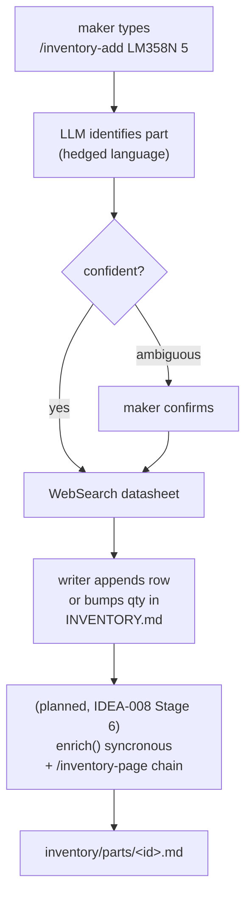
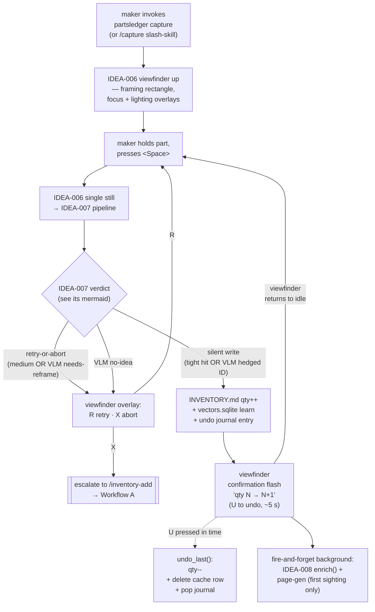
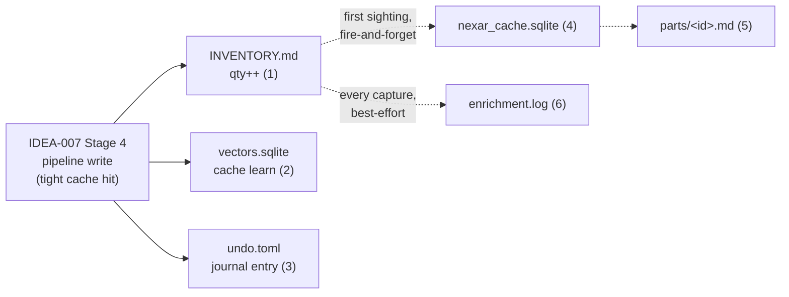

## Archive Reason

2026-05-14 — Promoted to EPIC-009 (integration-followups), tasks TASK-057..TASK-058. Sequencing, phase rollout, and cross-cut analysis absorbed into the per-idea epics (EPIC-002..EPIC-008).

> *Integration dossier.* Does **not** replace any of IDEA-004…008,
> IDEA-011, or IDEA-014 — it reads across them and surfaces the
> cross-cuts. Scope deliberately excludes IDEA-003 (external
> inventory tools), IDEA-010 (local model hosting), and IDEA-013
> (capture setup + colour calibration); all three stay on a longer
> horizon and are out of scope here. IDEA-013 is nearer-term than
> the other two — its quality-floor improvements directly help
> IDEA-007's cache stability and IDEA-011's accuracy — but the
> workflows in [Section 1](#section-1--the-full-workflows-from-the-makers-perspective)
> hold whether or not calibration is in place.

## Why this dossier exists

Each per-piece dossier hones its own slice well. None of them owns
the **seams between slices**: the shared INVENTORY.md writer, the
`config.toml` schema spread across two dossiers, the bootstrap
experience, the cross-stage fixture corpus, the PR sequencing across
files that several execution plans touch. This idea is the horizontal
pass — it does not introduce new design, it makes the cross-dossier
assumptions and gaps visible so they can be re-routed back into an
owning dossier or scheduled as their own work.

## Scope

In scope:

- [IDEA-004](idea-004-markdown-inventory-schema.md) — schema.
- [IDEA-005](idea-005-skill-path-today.md) — today's skill path.
- [IDEA-006](idea-006-usb-camera-capture.md) — camera capture.
- [IDEA-007](idea-007-visual-recognition-dinov2-vlm.md) — DINOv2 + VLM.
- [IDEA-008](idea-008-metadata-enrichment.md) — Nexar enrichment.
- [IDEA-011](idea-011-resistor-color-band-detector.md) — resistor
  reader (sibling tool, in scope only at the contract edge with
  PartsLedger).
- [IDEA-014](idea-014-project-setup-review-vs-circuitsmith.md) —
  `src/partsledger/` package layout + release pipeline, ported from
  CircuitSmith. In scope because every camera-path module from
  Phase 1 onwards has to live somewhere, and the "somewhere" is what
  IDEA-014 owns.

Out of scope:

- [IDEA-003](idea-003-external-inventory-tool-integration.md) —
  external inventory tool bridge. Independent long-horizon decision;
  re-opens if a maker actually wants to seed from InvenTree.
- [IDEA-010](idea-010-local-vlm-hosting.md) — local model hosting.
  Deployment concern owned by its own dossier; this dossier sees
  *"where the VLM / DINOv2 run"* as a configured env-var, not as a
  workflow step.
- [IDEA-013](idea-013-capture-setup-and-color-calibration.md) —
  capture-setup tiers and printed colour-calibration card.
  *Nearer-term future work* than IDEA-003 and IDEA-010: it directly
  helps IDEA-007's cache stability across lighting drift and
  IDEA-011's accuracy floor, and is the kind of thing a maker
  notices once Phase 2 lands. Still out of scope here because it's
  a *quality-floor* concern, not a *workflow-shape* concern — the
  workflows below hold whether or not calibration is in place. Re-fold
  into scope once it converts to a task.

---

## Section 1 — The full workflows from the maker's perspective

PartsLedger ships **two main workflows** plus **one sibling tool**.
Each is invoked deliberately by the maker; there is no mode switch and
no automatic hand-off between them.

### Workflow A — Skill path (today, [IDEA-005])

Already in production. The maker is at the keyboard in a Claude Code
session.

Strengths: zero hardware, works offline (modulo `WebSearch`), readable
audit trail in `git log`. Cost: ~30 s of LLM dialogue per part.

### Workflow B — Camera path ([IDEA-006] → [IDEA-007] → [IDEA-008])

Planned. The maker holds a part under the USB webcam and presses
`<Space>` (keyboard or BLE-HID pedal). The diagram below stays at the
**maker-event level** — the recognition brain's own four-way branch
(tight / tight-ambiguous / medium / miss) is drawn in
[IDEA-007 § The recognition pipeline](idea-007-visual-recognition-dinov2-vlm.md#the-recognition-pipeline)
and not redrawn here.

Strengths: silent ~1 s per repeat-sighting after the cache warms.
The confirmation flash is **immediate** (fires the moment the write
lands); enrichment and page-gen run in the background and do not gate
the next capture. Cost: one-time setup (webcam, DINOv2 weights, VLM
endpoint, optionally Nexar key).

### Workflow C — Resistor reader ([IDEA-011], sibling tool)

A standalone utility for the off-bench / no-setup phone-photo case.
Ships as a `pip install partsledger[resistor-reader]` extra —
*"sub-package inside PartsLedger, optional extra so it can be
installed standalone"*, closed 2026-05-14 in
[IDEA-011](idea-011-resistor-color-band-detector.md#open-questions-to-hone).
The maker-facing contract is unchanged either way: outputs a
value string (`4k7`, `100Ω`) the maker copy-pastes into
`/inventory-add`.

No write API from IDEA-011 into PartsLedger; no read API the other way.
Only contract is **value-formatting compatibility** ([IDEA-004]
schema's accepted resistor-value strings).

### How the maker chooses

Implicit, by hardware presence and intent:

- Phone in hand, no bench setup → Workflow C, then Workflow A.
- Bench, keyboard, a part the maker can already name → Workflow A.
- Bench, webcam set up, a tray of parts to ingest → Workflow B.

No mode switch in any UI surface. The skill path doesn't know the
camera path exists; the camera path doesn't know IDEA-011 exists. The
maker is the integrator.

---

## Section 2 — The unified data pipeline

What touches what, on disk and on the network. Both workflows
**converge on the same on-disk shape** ([IDEA-004]) — that is the
single load-bearing invariant.

### Files touched on a typical Workflow B capture (tight cache hit)

Solid arrows are the synchronous fan-out from the pipeline write;
dotted arrows are fire-and-forget background jobs that do not gate
the viewfinder's return to idle.

| # | Path | Writer | Why |
|---|---|---|---|
| 1 | `inventory/INVENTORY.md` | IDEA-007 Stage 4 (pipeline) via shared writer | qty++ on existing row |
| 2 | `inventory/.embeddings/vectors.sqlite` | IDEA-007 Stage 1 cache | new `(embedding, label, marking_text)` row |
| 3 | `inventory/.embeddings/undo.toml` | IDEA-007 Stage 5 journal | one-shot undo record |
| 4 (async) | `inventory/.embeddings/nexar_cache.sqlite` | IDEA-008 Stage 2 cache | only if first sighting |
| 5 (async) | `inventory/parts/<id>.md` | IDEA-005 page-gen (planned auto-trigger) | only if first sighting |
| 6 (async) | `inventory/.embeddings/enrichment.log` | IDEA-008 Stage 5 dispatch | best-effort, never gates writes |

A repeat-sighting capture only writes 1+2+3. A first-sighting capture
writes all six.

### Files touched on a Workflow A invocation

All writes synchronous — Workflow A blocks on the LLM dialogue
anyway, so there is no async benefit. The dashed arrows below are
the *planned* IDEA-008 Stage 6 chain (today only step 1 runs).

| # | Path | Writer | Why |
|---|---|---|---|
| 1 | `inventory/INVENTORY.md` | IDEA-005 `/inventory-add` writer | row appended or qty++ |
| 2 (planned) | `inventory/.embeddings/nexar_cache.sqlite` | IDEA-008 Stage 6 sync invocation | first sighting |
| 3 (planned) | `inventory/parts/<id>.md` | IDEA-005 page-gen (planned auto-trigger) | first sighting |

No DINOv2 cache write — Workflow A has no image. (See
[IDEA-007 § Open questions to hone](idea-007-visual-recognition-dinov2-vlm.md#open-questions-to-hone)
for the migration nuance: existing `parts/*.md` pages don't seed
the embedding cache because there are no source images.)

### External calls

| Source | Endpoint | Required? | Trigger |
|---|---|---|---|
| IDEA-005 `/inventory-add` | `WebSearch` (Claude Code tool) | yes today; replaced by IDEA-008 on land | every new part |
| IDEA-007 Stage 1 (first run) | `torch.hub` → DINOv2 weights (~80 MB) | once per machine | first invocation |
| IDEA-007 Stage 3 | `$PL_VLM_BASE_URL` (Anthropic / Mistral / Ollama / etc.) | only on cache miss or tight-ambiguous | per VLM call |
| IDEA-008 Stage 1 | `https://identity.nexar.com` + Nexar GraphQL | optional (silent skip if no key) | per first sighting |

Fully offline mode = `$PL_VLM_BASE_URL` points at localhost (IDEA-010)
**and** `$PL_NEXAR_*` unset. No other network call exists in the
pipeline. DINOv2 weights pre-pull is owned by
[IDEA-010 § Embedding backbone hosting](idea-010-local-vlm-hosting.md#embedding-backbone-hosting).

### Configuration surfaces

Per-maker config is spread across three sources today:

| Surface | What lives there | Owner |
|---|---|---|
| `.envrc` (gitignored) | `$PL_VLM_*`, `$PL_NEXAR_*`, `$PL_CAMERA` (optional override), `$PL_INVENTORY_PATH`, `$PL_PYTHON`, `$ANTHROPIC_API_KEY` | [`.envrc.example`](../../../../.envrc.example), [CLAUDE.md § Project env vars](../../../../CLAUDE.md#project-env-vars--use-pl_-never-hard-code-paths) |
| `~/.config/partsledger/config.toml` `[camera]` | persisted wizard pick (stable id + friendly name) | IDEA-006 |
| `~/.config/partsledger/config.toml` `[recognition]` | confidence-band thresholds, undo depth | IDEA-007 |
| `~/.config/partsledger/config.toml` `[paths]` | optional inventory-path override | CLAUDE.md |

The TOML sections are owned by different dossiers; a fully-populated
example with all three sections is shipped at
[`docs/developers/config.toml.example`](../../config.toml.example).

### Caches (all regenerable, all under `inventory/.embeddings/`)

| File | Owner | Lifetime | Rebuild trigger |
|---|---|---|---|
| `vectors.sqlite` | IDEA-007 Stage 1 | grows with captures | model-hash mismatch → empty-on-open; grows back organically |
| `nexar_cache.sqlite` | IDEA-008 Stage 2 | 30 days for `Active`, never for `Obsolete` | TTL eviction in `expire_stale()` |
| `undo.toml` | IDEA-007 Stage 5 | depth-1 by default | rolled forward on every write |
| `enrichment.log` | IDEA-008 Stage 5 | append-only | manual prune; nobody reads it on a happy day |

None of these are committed; all are regenerable from `inventory/`.

---

## Section 3 — Recommended implementation sequence

A six-phase rollout. Each phase is one or two PRs; later phases assume
earlier ones, but within a phase the named work is parallel.

### Phase 0 — Schema + lint foundation (no dependencies)

Lands first because every later writer depends on the schema shape.

- **IDEA-004 Stage 1** — `Source` column, section flexibility.
- **IDEA-005 Stage 1** — hedge-language lint (pre-commit).
- **IDEA-004 Stage 2** — parts-page template adaptivity (can ride along
  or follow; no integration dependency).

After Phase 0, the schema honed across [IDEA-004] is final enough that
both writers (the skill path's and the camera path's) can target it
without re-doing work.

### Phase 0b — Package layout + release plumbing ([IDEA-014])

Sequences between Phase 0 and Phase 1 because every Phase 1 module
(`partsledger/capture/`, `partsledger/recognition/`,
`partsledger/enrichment/`) needs a real Python package to live in.
Today [`pyproject.toml`](../../../../pyproject.toml) opts out of
package discovery (`[tool.setuptools] py-modules = []`); that has to
flip before any camera-path code is importable.

- Adopt the `src/partsledger/` layout, mirroring
  [CircuitSmith ADR-0012](../../../../../CircuitSmith/docs/developers/adr/0012-library-as-installable-package.md).
- Lift CircuitSmith's `RELEASING.md` + `/release` skill; rewrite
  the semver policy against PartsLedger's *three* public surfaces
  (Python API, CLI, INVENTORY.md schema — IDEA-014 flags the schema
  axis explicitly).
- Add `.github/workflows/ci.yml` + `release.yml`.
- Adopt `uv.lock` for reproducible installs.
- Shim convention for skills that ship code: thin argv-parsing only,
  import everything from `partsledger.*`.
- Run a drift audit on the already-copied `scripts/` files
  (`commit-pathspec.sh`, `housekeep.py`, `release_burnup.py`, etc.)
  to pull in any CircuitSmith improvements since the last copy.

After Phase 0b, every dotted module path the per-stage execution
plans quote (`partsledger/recognition/embed.py`,
`partsledger/capture/viewfinder.py`, `partsledger/enrichment/nexar.py`)
corresponds to a real file under `src/`, not a future fiction.

**Open in [IDEA-014]:** cut-over timing — land Phase 0b *now*
(cheapest, but the release pipeline ships nothing useful yet) or
defer until the first camera-path module from Phase 1 is ready
(layout exists from day one of real code, but means refactoring
mid-stream). This sequence assumes *land now* because the alternative
forces every Phase 1 PR to either pre-create the layout itself or
land into the wrong place and migrate later.

### Phase 1 — Camera-path primitives, all independent

Each item in this phase can land in its own PR; no item gates any
other. The phase is **wide and shallow**.

- **IDEA-007 Stage 1** — DINOv2 embed + `sqlite-vec` cache primitives.
- **IDEA-007 Stage 2** — cache-only recognition (no VLM, no writer).
- **IDEA-007 Stage 3** — VLM REST adapter (mocked, no pipeline glue).
- **IDEA-006 Stage 1** — camera-selection wizard + persistence.
- **IDEA-006 Stage 2** — viewfinder + capture-time overlays.
- **IDEA-006 Stage 3** — capture trigger emits the
  [Output contract](idea-006-usb-camera-capture.md#output-contract-to-downstream)
  packet.
- **IDEA-006 Stage 6** — CLI wrapper (`python -m partsledger.capture`).
  Useful immediately as a fixture-image source for IDEA-007 development.
- **IDEA-008 Stages 1+2+3** — Nexar client, response cache,
  family-datasheet fallback.
- **IDEA-008 Stage 4** — standalone enrichment orchestrator + writer
  integration (callable; not yet wired to either path).

After Phase 1, every primitive of the camera path exists in isolation
and is unit-testable, but they don't yet talk to each other.

### Phase 2 — Integration (the hard part)

This is where Phase 1's primitives wire together into a working camera
path. Sequencing matters because everything in this phase touches the
shared INVENTORY.md writer contract pinned in
[IDEA-004 § `INVENTORY.md` writer contract](idea-004-markdown-inventory-schema.md#inventorymd-writer-contract).

- **IDEA-007 Stage 4** — pipeline glue + branching. Calls into the
  shared writer. First consumer of the
  [IDEA-004 writer contract](idea-004-markdown-inventory-schema.md#inventorymd-writer-contract)
  — the contract pre-exists; this stage is the first runtime exercise of it.
- **IDEA-006 Stage 4** — recognition-status overlay state machine.
  Lands against IDEA-007 Stage 4's verdict payload.
- **IDEA-008 Stage 5** — camera-path async dispatch. Hooks into
  IDEA-007 Stage 4's pipeline edge.

After Phase 2, a capture produces a silent qty++ end-to-end (cache
learn + best-effort enrichment in the background) but **no undo** and
**no R/X/U keys**.

### Phase 3 — Safety net + UX polish

The maker-survival keys land here so a wrong write is recoverable.

- **IDEA-007 Stage 5** — undo journal + `undo_last()`.
- **IDEA-006 Stage 5** — `R` / `X` / `U` key handlers.
- **[IDEA-005 Stage 3](idea-005-skill-path-today.md#stage-3--page-generation-auto-trigger-on-row-creation)**
  — page-gen auto-trigger on row creation; chains `/inventory-add`
  → enrichment → `/inventory-page`.
- **IDEA-008 Stage 6** — skill-path sync invocation + page-gen chain.

After Phase 3, the camera path is feature-complete from the maker's
perspective, and Workflow A's `/inventory-add` auto-runs enrichment +
page-gen synchronously.

### Phase 4 — Slash-skill wrapper

- **IDEA-006 Stage 7** — `/capture` slash-skill, thin subprocess
  wrapper around the Phase 1 Stage 6 CLI.

Deliberately last because the slash-skill spec depends on a stable CLI
flag set; bundling earlier means re-spinning the wrapper.

### Phase 5 — Skill-path polish, schedule-flexible

- **IDEA-005 Stage 2** — family-page proactive suggestion.

Independent of the camera-path rollout. Can land any time after
IDEA-004 Stage 1 — slot it whenever convenient.

### Phase 6 — Sibling tool ([IDEA-011])

- **IDEA-011** — resistor-reader V1 (still-image), then V2 (live-view).

Lives inside the PartsLedger source tree per the
[2026-05-14 sub-package resolution](idea-011-resistor-color-band-detector.md#open-questions-to-hone),
shipped as `partsledger[resistor-reader]`. Sequencing
consequence: **Phase 6 depends on Phase 0b** having landed
(the `src/partsledger/` layout is what `resistor_reader/` lives
inside) and on the release pipeline supporting PEP 517 extras.
The maker still decides *when* within that window.

### What "useful" looks like at each phase boundary

| After phase | What the maker can do |
|---|---|
| 0 | Workflow A still works as today, with the new `Source` column and hedge-lint backstop. |
| 1 | Workflow A unchanged. Camera path can capture frames into a directory; recognition primitives unit-tested but don't yet write inventory. |
| 2 | Workflow B *works* end-to-end for the happy path — silent qty++, enrichment fills cells in background. No undo yet. |
| 3 | Workflow B is feature-complete; wrong writes are recoverable with `U`; Workflow A auto-runs enrichment + page-gen. |
| 4 | `/capture` invokable from inside a Claude session. |
| 5 | Workflow A proactively suggests family pages. |
| 6 | IDEA-011 ships in its own repo, value strings copy-pasteable into Workflow A. |

---

## Section 4 — Identified gaps

Things no dossier currently owns, listed so they can either be
re-routed into an existing dossier or scheduled as their own task.
Each gap names a **recommended owner**; this dossier doesn't try to
solve them, only to enumerate them.

Most of the originally-enumerated gaps were re-routed into their
owning dossier during the 2026-05-14 follow-up — see
[§ Closed during the 2026-05-14 follow-up](#closed-during-the-2026-05-14-follow-up)
at the end of this section for one-line pointers to where each
landed. Numbering is preserved (Gap 5, 6, 9) so external references
into this dossier — including this section's anchors — don't break.

### Gap 5 — Bootstrap / first-run experience is undefined

No dossier owns *"the maker has just cloned the repo; what happens?"*.
Implicit answers exist across the dossiers (copy `.envrc`, run
`direnv allow`, install heavy Python deps, first invocation pulls
DINOv2 weights, first camera invocation runs the wizard, first
`/inventory-add` does WebSearch). But there is no single document
sequencing this, and no `partsledger setup` entry-point.

**Partially relieved by [IDEA-014].** Once Phase 0b lands, the install
step collapses to `pip install partsledger` (optionally
`pip install partsledger[resistor-reader]`), with `uv.lock` for
reproducibility. That removes *"install heavy Python deps"* from
the bootstrap narrative but leaves the rest (`.envrc`, camera
wizard, model downloads, first `/inventory-add`).

**Recommended owner.** Defer until Phase 1 lands and the actual
ordering is observable. A new dossier becomes worthwhile once a
maker has walked the path post-IDEA-014.

### Gap 6 — Cross-stage test-fixture corpus

Each dossier defers fixtures to *"implementation time"*:

- [IDEA-007] Stage 4 needs golden frames + cached embeddings.
- [IDEA-008] Stages 5+6 need mocked Nexar responses.
- [IDEA-006] Stage 4 needs mocked pipeline verdicts.

None of these contracts overlap exactly, but the **camera-path
end-to-end fixture** — a captured frame → tight cache hit → silent
write → enrichment populates cells — needs all three sets composed.
The first implementer of Phase 2 will build a corpus; the question is
whether the corpus lives somewhere a Phase 3 implementer can find it.

**Recommended owner.** Implementation task spawned alongside Phase 2:
*"PartsLedger pipeline test fixture corpus"* under `tests/fixtures/`.
Not a new idea; just a task to file when Phase 2 starts.

### Gap 9 — IDEA-011 value-format compatibility

[IDEA-011]'s only runtime contract with PartsLedger is *"output
strings that `/inventory-add` accepts as input"*. There is no
shared schema file; compatibility is informal. If [IDEA-004]'s
resistor-value acceptance ever tightens or [IDEA-011]'s output
style drifts, the contract silently breaks.

**Recommended owner.** No dossier work today; when [IDEA-011] V1
lands, add a one-line test on the PartsLedger side that walks a
sample of [IDEA-011] outputs through `/inventory-add`'s parser.

(The sister question — *spinoff repo vs sub-package* — was
closed 2026-05-14 in favour of `partsledger[resistor-reader]`;
see the [closed-gaps footer](#closed-during-the-2026-05-14-follow-up)
below.)

### Closed during the 2026-05-14 follow-up

These gaps were re-routed into their owning dossier (or, in
Gap 3's case, fixed inline) during a single follow-up pass.
Listed here for traceability — the live work is in the linked
location, and the former section anchors have been retired.

- **Gap 1** — *INVENTORY.md writer interface is implicit.*
  Re-routed to
  [IDEA-004 § `INVENTORY.md` writer contract](idea-004-markdown-inventory-schema.md#inventorymd-writer-contract).
- **Gap 2** — *No single `config.toml` example.* Shipped as
  [`docs/developers/config.toml.example`](../../config.toml.example);
  linked from
  [IDEA-007 § Configuration files](idea-007-visual-recognition-dinov2-vlm.md#configuration-files).
- **Gap 3** — *`.envrc.example` / `config.toml` drift.* Fixed in
  [`.envrc.example`](../../../../.envrc.example).
- **Gap 4** — *IDEA-005's page-gen auto-trigger isn't in its
  execution plan.* Re-routed to
  [IDEA-005 § Stage 3 — Page-generation auto-trigger on row creation](idea-005-skill-path-today.md#stage-3--page-generation-auto-trigger-on-row-creation).
- **Gap 7** — *Codeowner-skill coverage when the writer is
  Python, not Claude.* Re-routed to
  [IDEA-004 § Open questions to hone](idea-004-markdown-inventory-schema.md#open-questions-to-hone)
  (candidate answer: `scripts/lint_inventory.py`).
- **Gap 8** — *Cache seeding from today's hand-built inventory.*
  Re-routed to
  [IDEA-007 § Open questions to hone](idea-007-visual-recognition-dinov2-vlm.md#open-questions-to-hone)
  (closed there as expected behaviour).
- **Gap 9 (a)** — *Spinoff repo vs sub-package.* Resolved as
  `partsledger[resistor-reader]` sub-package; closed in
  [IDEA-011](idea-011-resistor-color-band-detector.md#open-questions-to-hone)
  and
  [IDEA-014](idea-014-project-setup-review-vs-circuitsmith.md#open-questions).
  Sequencing consequence: [Phase 6](#phase-6--sibling-tool-idea-011)
  now depends on Phase 0b.
- **Gap 10** — *Cross-platform cache portability.* Re-routed to
  [IDEA-010 § Open questions to hone](idea-010-local-vlm-hosting.md#open-questions-to-hone).

---

## Section 5 — Implementation plan: from ideas to epics

This dossier surveys the work but doesn't enact it. Two moves
translate the survey into something the task system can drive:

1. **The in-scope ideas get promoted to epics.** Each dossier's
   execution-plan stages become tasks under a new epic with the
   same name. Out-of-scope ideas
   ([IDEA-003](idea-003-external-inventory-tool-integration.md),
   [IDEA-010](idea-010-local-vlm-hosting.md),
   [IDEA-013](idea-013-capture-setup-and-color-calibration.md))
   stay as ideas until the maker chooses to commit to them.

   | Dossier | Becomes epic | Tasks seeded from |
   |---|---|---|
   | [IDEA-004](idea-004-markdown-inventory-schema.md) | EPIC — Markdown inventory schema | Stages 1–3 |
   | [IDEA-005](idea-005-skill-path-today.md) | EPIC — Skill path (`/inventory-add`, `/inventory-page`) | Stages 1–3 |
   | [IDEA-006](idea-006-usb-camera-capture.md) | EPIC — USB camera capture | Stages 1–7 |
   | [IDEA-007](idea-007-visual-recognition-dinov2-vlm.md) | EPIC — Visual recognition (DINOv2 + VLM) | Stages 1–5 |
   | [IDEA-008](idea-008-metadata-enrichment.md) | EPIC — Metadata enrichment (Nexar) | Stages 1–6 |
   | [IDEA-011](idea-011-resistor-color-band-detector.md) | EPIC — Resistor reader | V1 still-image, V2 live-view |
   | [IDEA-014](idea-014-project-setup-review-vs-circuitsmith.md) | EPIC — Project setup (Phase 0b) | dossier as a whole |

2. **A new epic absorbs the three open gaps in Section 4** —
   they don't naturally belong to any existing dossier's epic, so
   they cluster on their own:

   **EPIC — IDEA-012 integration-pass follow-ups**

   | Task | Was | Prerequisite | On resume |
   |---|---|---|---|
   | Evaluate need for bootstrap dossier | [Gap 5](#gap-5--bootstrap--first-run-experience-is-undefined) | last Phase 1 task closes | maker writes the dossier, or closes with a one-line *"not needed — Phase 1 made the bootstrap obvious"* |
   | Pipeline test-fixture corpus | [Gap 6](#gap-6--cross-stage-test-fixture-corpus) | IDEA-007 Stage 4 task moves to active | build `tests/fixtures/` per gap spec |
   | IDEA-011 ↔ `/inventory-add` value-format contract test | [Gap 9](#gap-9--idea-011-value-format-compatibility) | IDEA-011 V1 task closes | add the one-line parser test |

   All three are filed paused. Prerequisites start as prose
   references to future tasks; each gets re-pinned to a specific
   `TASK-NNN` the moment that task is created (i.e. when its
   parent idea is promoted to an epic).

### Sequencing the promotions

The new follow-up epic above lands immediately — three paused
tasks costs almost nothing and removes Section 4 as a memory
dependency. The dossier-to-epic promotions track the phasing
in [Section 3](#section-3--recommended-implementation-sequence):

- **Now (Phase 0):** [IDEA-004](idea-004-markdown-inventory-schema.md),
  [IDEA-005](idea-005-skill-path-today.md) — both already have
  execution plans and partial implementations; promotion makes
  the in-flight work visible in the kanban.
- **Before Phase 1:** [IDEA-014](idea-014-project-setup-review-vs-circuitsmith.md)
  — its Phase 0b is the layout prerequisite for every camera-path
  task that follows.
- **At Phase 1 start:** [IDEA-006](idea-006-usb-camera-capture.md),
  [IDEA-007](idea-007-visual-recognition-dinov2-vlm.md),
  [IDEA-008](idea-008-metadata-enrichment.md) — promoted
  together; their epics light up in parallel and their stage-1
  tasks become Phase 1's actual work.
- **At Phase 6 start** (= maker commits to building the resistor
  reader): [IDEA-011](idea-011-resistor-color-band-detector.md)
  — depends on Phase 0b having shipped.

Promotion is mechanical: `/ts-epic-new` scaffolds the epic file,
`/ts-task-new` per execution-plan stage. Each dossier's stage
list maps near-1:1 to its epic's task list; the dossier itself
stays in `ideas/open/` as the design reference.

### When this section is fully enacted

Section 4's three open gaps move into the closed-gaps footer with
pointers into the new follow-up epic; Section 4 then has nothing
live to track. Every in-scope dossier is represented in the
kanban by an active or paused epic. IDEA-012's surveying job is
done; this dossier reaches its self-stated archival endpoint, and
the reference half — [Section 1](#section-1--the-full-workflows-from-the-makers-perspective)
workflows, [Section 2](#section-2--the-unified-data-pipeline) data
pipeline, [Section 3](#section-3--recommended-implementation-sequence)
phasing — continues to live as a system-overview doc, decoupled
from IDEA-012's own lifecycle.

---

## What this dossier does **not** do

- Does not introduce new design. Every decision referenced here lives
  in another dossier.
- Does not gate any other dossier's execution plan. The sequencing in
  [Section 3](#section-3--recommended-implementation-sequence) is
  advisory; if reality re-orders things, this dossier gets updated.
- Does not become a new bottleneck. Once the gaps in
  [Section 4](#section-4--identified-gaps) are either re-routed or
  scheduled, this dossier could plausibly be archived.

## Related

- [IDEA-004](idea-004-markdown-inventory-schema.md) — schema foundation.
- [IDEA-005](idea-005-skill-path-today.md) — Workflow A.
- [IDEA-006](idea-006-usb-camera-capture.md) — Workflow B front-end.
- [IDEA-007](idea-007-visual-recognition-dinov2-vlm.md) — Workflow B brain.
- [IDEA-008](idea-008-metadata-enrichment.md) — Workflow B + A enrichment.
- [IDEA-011](idea-011-resistor-color-band-detector.md) — Workflow C
  sibling tool.
- [IDEA-014](idea-014-project-setup-review-vs-circuitsmith.md) — Phase 0b
  package + release pipeline.
- [IDEA-003](idea-003-external-inventory-tool-integration.md) —
  explicitly out of scope here; long-horizon.
- [IDEA-010](idea-010-local-vlm-hosting.md) — explicitly out of scope
  here; deployment-concern dossier.
- [IDEA-013](idea-013-capture-setup-and-color-calibration.md) —
  explicitly out of scope here; nearer-term future work that lifts
  the quality floor for [IDEA-007] and [IDEA-011] without changing
  workflow shape.
