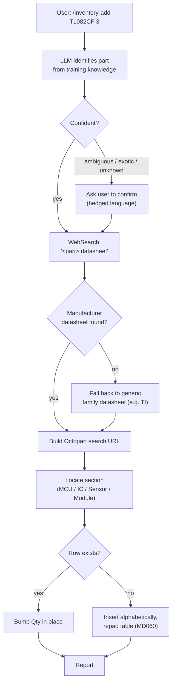

> *Replaces the "Skill Path" + "Sincere-Language Convention" sections of
> the retired IDEA-001 dossier.* These two skills are the **today**-tooling
> — already in production use, no hardware needed beyond a keyboard. They
> are also the reference behaviour the camera path
> ([IDEA-006](idea-006-usb-camera-capture.md) → [IDEA-008](idea-008-metadata-enrichment.md))
> must match when it produces the same on-disk shape.

## Status

✅ **In use.** The two skills live in
[`.claude/skills/inventory-add/`](../../../../.claude/skills/inventory-add/)
and
[`.claude/skills/inventory-page/`](../../../../.claude/skills/inventory-page/).
The six pages under [`inventory/parts/`](../../../../inventory/parts/)
were produced by this path.

## `/inventory-add <part-id> <qty>` (also batched: `…, <part-id> <qty>`)

### Specials

- **Bulk / kits** — generic classes (assorted `1N4148`, carbon-film
  resistor set) skip the row workflow and go to the **Bulk / kits**
  section as a bullet entry. We don't catalogue individual values.
- **Hedge language is mandatory.** *"Likely the X from Y"*, never
  *"is X"*. The user is ground truth; the LLM is a guess until they
  confirm. Enforced by phrasing rules inside the skill prompt.
- **Package assumption.** The maker's drawer is through-hole. Function
  descriptions never claim a SOIC variant even when the marking suggests
  it — the physical part on the bench is the ground truth, the marking
  is a hint.
- **Batching.** A single invocation can pass multiple `<part> <qty>`
  pairs separated by commas; the skill walks them sequentially so each
  identification stays auditable.

## `/inventory-page <part-id>`

Generates a one-page reference for a part that's already in
`INVENTORY.md`, then re-links the Part cell to it. The page structure is
defined by the schema dossier — see
[IDEA-004 § `parts/<id>.md`](idea-004-markdown-inventory-schema.md#partsidmd--the-optional-reference-page).

Key constraints the skill enforces:

- **Prose, not schema.** The page reads like a maker's notebook —
  metaphors, gotchas, sample circuit as a connection list. Frontmatter
  is intentionally absent on the page (machine-readable bits, if/when
  they land, are an open question on [IDEA-004](idea-004-markdown-inventory-schema.md#open-questions-to-hone)).
- **No invented links.** Datasheet and Octopart URLs are reused from
  `INVENTORY.md`, never re-fetched or guessed.
- **ASCII pinout walls must align.** The DIP-N top-view diagram is
  rendered with a strict character budget; an off-by-one breaks the
  visual.
- **Family pages.** When two `INVENTORY.md` rows are revisions of the
  same chip, the skill produces a single shared page (filename = canonical
  variant) and updates both rows' Notes cells with *"Shares page with
  …"*. See [IDEA-004 § Family pages](idea-004-markdown-inventory-schema.md#family-pages).

## The sincere-language convention

Both skills share one phrasing rule: **hedge identifications, mark
estimates as estimates, never use `must / always / never` as rhetorical
emphasis.**

- The component on the bench is the ground truth.
- The LLM (or a future VLM) is a guess until the maker confirms.
- *"At a glance"* specs in `parts/*.md` use `~`, `up to`, `typically`
  rather than absolute claims.
- The camera path ([IDEA-007](idea-007-visual-recognition-dinov2-vlm.md))
  inherits this rule unchanged when it lands.

This is enforced inside the skills' prompts (phrasing patterns in
`inventory-add`, qualifying language in `inventory-page`) and is also a
project-wide convention surfaced by the
[`co-inventory-master-index`](../../../../.claude/skills/co-inventory-master-index/SKILL.md)
and
[`co-inventory-schema`](../../../../.claude/skills/co-inventory-schema/SKILL.md)
codeowner skills.

## Why this idea, not just "read the SKILL.md"

The SKILL.md files are the runtime spec — what Claude does when invoked.
This dossier is the **honable** view: the trade-offs that went into the
flow, the open questions about the flow, the things the camera path
must replicate. The SKILL.md prompts can drift to match decisions made
here.

## What we build vs. what we use

| Component | Source | Status |
|---|---|---|
| `/inventory-add` skill | This repo, `.claude/skills/inventory-add/` | ✅ in use |
| `/inventory-page` skill | This repo, `.claude/skills/inventory-page/` | ✅ in use |
| Datasheet lookup | `WebSearch` tool | ✅ in use |
| Markdown writer + table padding | Inside the skills themselves | ✅ in use |

No hardware. No external services beyond `WebSearch`. The whole path runs
inside the Claude Code session.

## Open questions to hone

- **Confidence-aware revisit.** A row added as *"likely the TL082CF"* is
  currently marked only in commit history. Would a `Confirmed: no` flag
  in the Notes column (or a separate `INVENTORY.md` subsection) make
  re-review easier?
- **Provenance tagging.** Camera-path rows and skill-path rows will both
  live in `INVENTORY.md`. Do we need a `Source: skill|camera` marker, or
  is `git blame` enough?
- **Headless / plain-text mode.** When the maker is on a terminal without
  Claude Code (e.g. ssh into the workshop machine), is there value in a
  pure-shell `pl inv-add` CLI that mirrors the skill behaviour minus the
  LLM identification step?
- **Multi-tenant kits.** A "carbon-film resistor set" is one bullet
  today. When the maker actually starts using a 220 Ω from it, does
  that promote to a row? Stay as a bullet? Both?
- **Family-page proactive suggestion.** `/inventory-page` could detect
  that `LM358P` is being added while `LM358N` already has a page, and
  suggest a family-page merge. Worth automating?
- **Hedge-language lint.** The skills enforce phrasing by prompt
  example; could we add an offline lint that catches `is the` / `must`
  / `always` in newly added `parts/*.md` blocks?

## Related

- [IDEA-004](idea-004-markdown-inventory-schema.md) — the on-disk shape
  this skill writes.
- [IDEA-006](idea-006-usb-camera-capture.md) — the future hardware
  front-door whose output has to plug into the same writer.
- [IDEA-007](idea-007-visual-recognition-dinov2-vlm.md) — the camera-path
  recognition that produces the same row shape this skill produces by
  hand.
- [IDEA-003](idea-003-external-inventory-tool-integration.md) — the
  InvenTree bridge, which would seed this skill with rows it didn't
  type itself.
