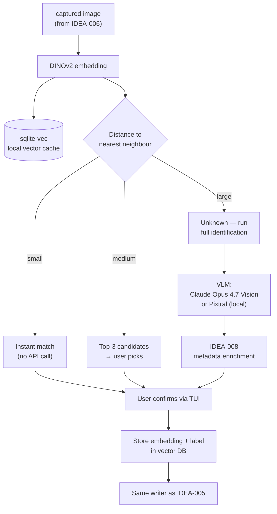

> *Replaces the camera-path "DINOv2 + VLM" stages from the retired
> IDEA-001 dossier.* The most interesting unsolved piece of PartsLedger
> — and the one whose architecture decisions cascade through the rest of
> the camera path.

## Status

⏳ **Planned.** Neither stage is implemented. The vector cache directory
(`inventory/.embeddings/vectors.sqlite`) is named in the schema dossier
([IDEA-004](idea-004-markdown-inventory-schema.md#directory-layout)) but
holds no data yet.

## Why the two stages stay in one idea

DINOv2 cache and VLM identification *could* be split into separate
dossiers, but operationally they are one decision. The cache is only
useful because of its fallback to the VLM; the VLM is only affordable
because of the cache. Tuning one without the other doesn't make sense.

## The two-stage pipeline

## Stage 1 — DINOv2 as similarity cache

The crucial framing: **DINOv2 is not a classifier**. It produces a 768-D
embedding per image; classification is `argmin(distance)` over the
labelled embeddings already in the cache.

Implications:

- **No training session.** A part's first sighting goes through the VLM
  and lands in the cache. Subsequent sightings of the same part-type
  match the cache directly. After 3–5 photos per part, recognition is
  effectively free.
- **Active-learning loop.** Every user-confirmed identification
  contributes its embedding+label to the cache. Misidentifications, once
  the user corrects them, also contribute as a "this image is NOT
  part X" signal (negative-example handling — see open questions).
- **No retraining.** The DINOv2 backbone is frozen. The "learning" is
  the growing cache, nothing else.

### Backbone

`facebookresearch/dinov2` via `torch.hub`. The ViT-S/14 variant is the
sweet spot — 21M params, runs on CPU at ~200 ms/image, on a consumer
GPU at < 20 ms.

### Vector DB

Two candidates:

- **`sqlite-vec`** *(preferred)*. SQLite extension, file-based, ships
  next to the inventory's other artefacts. Aligns with the
  MD-as-source-of-truth ethos: the cache is one extra file in
  `inventory/.embeddings/`, regenerable from images + MDs.
- **FAISS**. Battle-tested, faster at scale, but a heavier dependency
  and no native SQL story. Worth it only if `sqlite-vec` becomes a
  bottleneck — unlikely at hobbyist scale (< 10k parts).

## Stage 2 — VLM identification

Runs only on cache miss (or when the user explicitly asks for a "second
opinion" — see open questions). Reads the image, optionally also reads
the top-3 DINOv2 candidates as a prompt-side hint, and emits a hedged
identification: *"likely the L7805CV, voltage regulator, TO-220-3"*.

### VLM choice

| VLM | Hosted/local | Cost | License | Notes |
|---|---|---|---|---|
| **Claude Opus 4.7 Vision** | Hosted (Anthropic) | per-image API | proprietary | Strongest at reading marking text; uses `$ANTHROPIC_API_KEY` |
| **Pixtral 12B** | Self-host (`vllm`) | one-time GPU | Apache 2.0 | Enables fully offline mode; needs ~24 GB VRAM |

Pluggable: a single `VLMBackend` interface in code, two adapters. The
maker picks per session (or per request, if VRAM is sometimes unavailable).

### Hedge-language enforcement

The VLM's structured output is constrained to the hedge phrasing the
skill path already uses (see
[IDEA-005 § Sincere-language convention](idea-005-skill-path-today.md#the-sincere-language-convention)).
Concretely: the prompt forbids `must / always / never`, and the parser
rejects an identification that doesn't start with a hedging adverb
(`likely`, `probably`, `appears to be`).

## Fully offline mode

With Pixtral 12B and no [IDEA-008](idea-008-metadata-enrichment.md)
Nexar/Octopart calls, the entire camera pipeline runs offline after
model download. No request leaves the workstation. The trade-off is the
manual datasheet step — the maker pastes the URL after identifying the
part.

This is a real option, not aspiration. The architecture is designed so
the offline path is a config switch, not a fork.

## Confidence bands

The three branches (instant / top-3 / VLM) are gated by distance
thresholds against the cache. Initial guess:

| Band | Distance | Behaviour |
|---|---|---|
| Tight | `< 0.10` | Accept the cache hit, just bump qty |
| Loose | `0.10–0.25` | Show top-3 in TUI, let user pick or escalate |
| Miss | `> 0.25` | Run VLM identification |

Numbers are placeholders — the right values come from running the
backbone over the first ~100 captures and looking at the distance
histogram. **Worth honing** before any production use.

## What we build vs. what we use

| Component | Source | Status |
|---|---|---|
| Embedding backbone | `facebookresearch/dinov2` via `torch.hub` | ⏳ planned |
| Vector cache | `sqlite-vec` (or FAISS) | ⏳ planned |
| VLM, hosted | Anthropic SDK (Claude Opus 4.7 Vision) | ⏳ planned |
| VLM, self-hosted | Pixtral 12B via `vllm` (Apache 2.0) | ⏳ planned |
| Confidence-band tuning | This repo, after first ~100 captures | ⏳ planned |
| Hedge-language constrainer | Prompt rules + parser, this repo | ⏳ planned |

## Open questions to hone

- **Vector DB choice.** `sqlite-vec` vs FAISS — most likely the former,
  but worth sanity-checking against expected scale (parts × captures-
  per-part) and DINOv2 dimension.
- **GPU requirements.** Pixtral 12B needs ~24 GB VRAM at fp16. Worth
  it for the offline guarantee, or hosted-VLM only? Hybrid (Pixtral for
  cache-confirm, Claude for cache-miss)?
- **Confidence-band thresholds.** Initial `<0.10 / <0.25 / else`
  guess. Calibrate on real captures before promoting to defaults.
- **Negative-example handling.** When the user says "no, that's a
  TL082, not an LM358" — does the wrong-label embedding get *deleted*
  from the cache, or stored as a negative example? Negative examples
  complicate kNN.
- **Multi-shot averaging.** Mean of 3 angle embeddings as the cache key?
  Improves robustness but doubles capture time (IDEA-006 multi-angle
  flow).
- **Second-opinion mode.** Even on a tight cache hit, let the maker
  request a VLM verification (cheap insurance against the cache
  poisoning itself early on).
- **Marking-text bias.** The VLM is unusually good at reading marking
  text — should the cache also store an OCR'd marking as a secondary
  key, so `LM358N` and `LM358P` don't collapse into one cluster?
- **Backbone choice.** DINOv2-ViT-S/14 is the proposed default; worth
  benchmarking against ViT-B/14 or CLIP for marking-text-heavy parts.
- **Cache rebuild policy.** What happens when DINOv2's weights change
  upstream? Re-embed all stored images? Pin the model hash?

## Related

- [IDEA-004](idea-004-markdown-inventory-schema.md) — the schema this
  stage's output has to fit, unmodified.
- [IDEA-005](idea-005-skill-path-today.md) — the hedge-language
  convention this stage inherits.
- [IDEA-006](idea-006-usb-camera-capture.md) — upstream; image quality
  drives recognition reliability.
- [IDEA-008](idea-008-metadata-enrichment.md) — downstream; runs only
  after identification succeeds.
