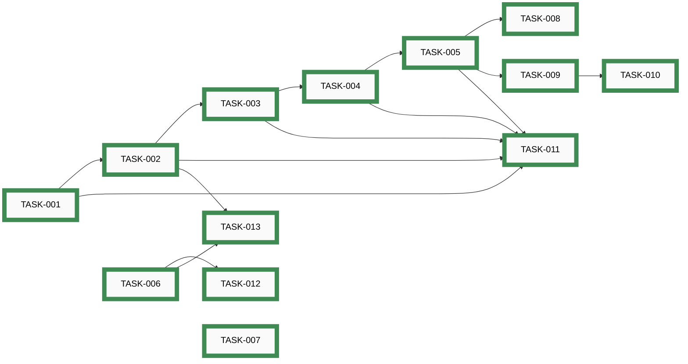
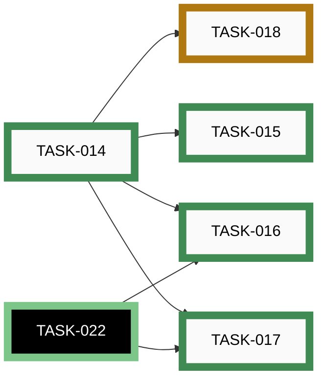
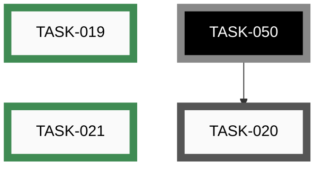
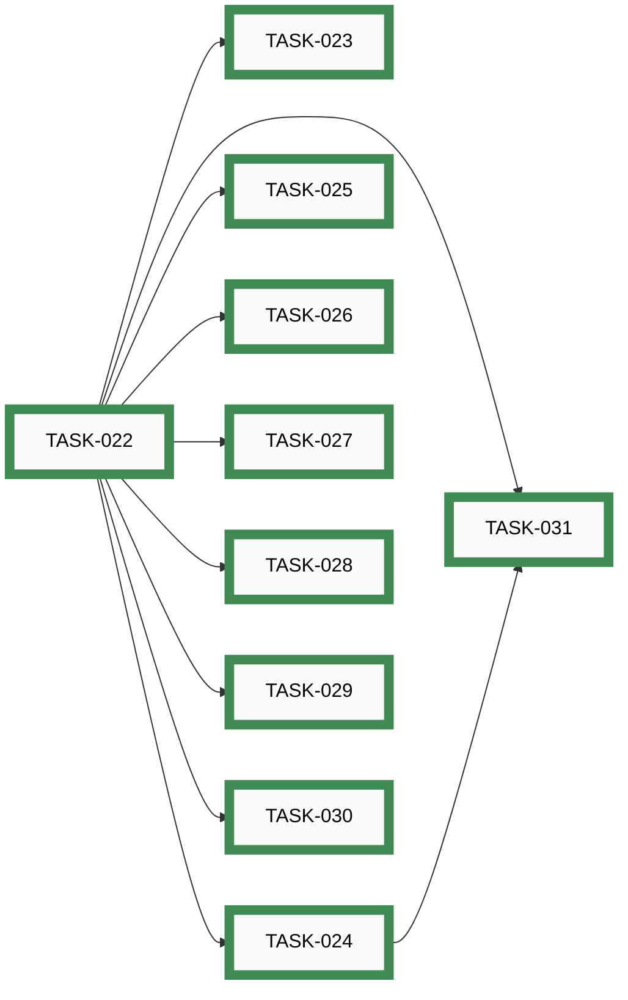
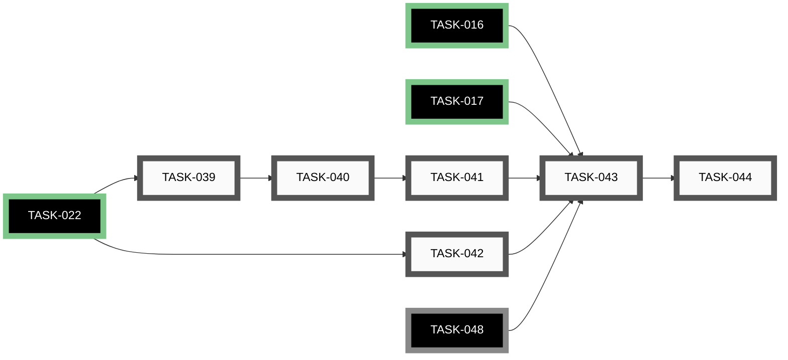
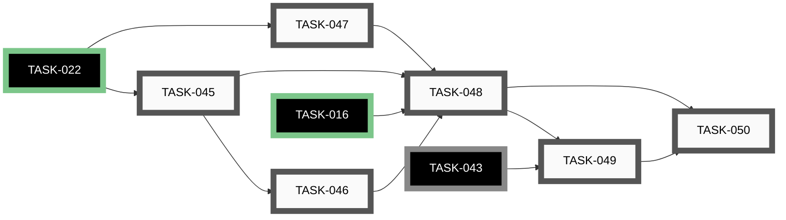
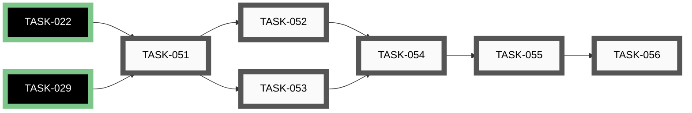
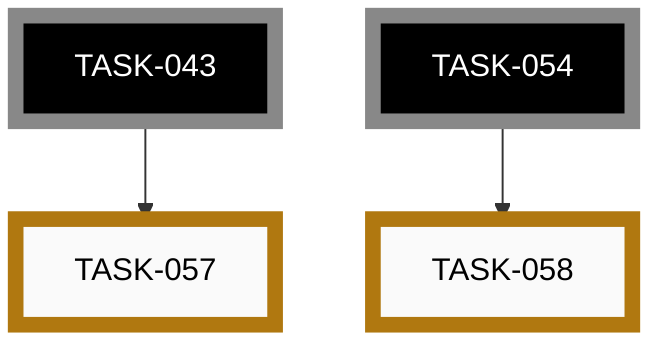

# Epics

_Auto-generated by `housekeep.py`. Do not edit manually._

**Overall:** 🔵 **active** — ██████░░░░ 34/58 (59%) across 9 groups — 21 open · 0 active · 3 paused · 34 closed

## Index

| Epic | Title | Status | Open | Active | Paused | Closed | Done |
|------|-------|--------|-----:|-------:|-------:|-------:|------|
| [EPIC-001](#epic-001-align-with-circuitsmith-framework) | Align with CircuitSmith framework | 🟢 closed | 0 | 0 | 0 | 13 | ██████████ 100% |
| [EPIC-002](#epic-002-markdown-inventory-schema) | Markdown inventory schema | 🔵 **active** | 0 | 0 | 1 | 4 | ████████░░ 80% |
| [EPIC-003](#epic-003-skill-path--inventory-add-and-inventory-page) | Skill path — /inventory-add and /inventory-page | 🔵 **active** | 1 | 0 | 0 | 2 | ███████░░░ 67% |
| [EPIC-004](#epic-004-project-setup--port-from-circuitsmith) | Project setup — port from CircuitSmith | 🟢 closed | 0 | 0 | 0 | 10 | ██████████ 100% |
| [EPIC-005](#epic-005-usb-camera-capture) | USB camera capture | 🔵 **active** | 2 | 0 | 0 | 5 | ███████░░░ 71% |
| [EPIC-006](#epic-006-visual-recognition--dinov2--vlm) | Visual recognition — DINOv2 + VLM | ⚪ _open_ | 6 | 0 | 0 | 0 | ░░░░░░░░░░ 0% |
| [EPIC-007](#epic-007-metadata-enrichment--nexar) | Metadata enrichment — Nexar | ⚪ _open_ | 6 | 0 | 0 | 0 | ░░░░░░░░░░ 0% |
| [EPIC-008](#epic-008-resistor-color-band-reader) | Resistor color-band reader | ⚪ _open_ | 6 | 0 | 0 | 0 | ░░░░░░░░░░ 0% |
| [EPIC-009](#epic-009-idea-012-integration-pass-follow-ups) | IDEA-012 integration-pass follow-ups | 🔵 **active** | 0 | 0 | 2 | 0 | ░░░░░░░░░░ 0% |

---

## EPIC-001: Align with CircuitSmith framework

[↑ back to top](#index)

**Status:** 🟢 closed — ██████████ 13/13 (100%)

| Order | ID | Title | Status | Effort |
|-------|----|-------|--------|--------|
| 1 | ~~[TASK-001](closed/task-001-delete-sync-layer.md)~~ | ~~Delete awesome-task-system/ and scripts/sync_task_system.py~~ | 🟢 closed | Small |
| 2 | ~~[TASK-002](closed/task-002-python-skeleton.md)~~ | ~~Author Python project skeleton (pyproject, requirements-dev, CI, conftest, gitignore)~~ | 🟢 closed | Small |
| 3 | ~~[TASK-003](closed/task-003-replace-pre-commit.md)~~ | ~~Replace scripts/pre-commit with the CircuitSmith version~~ | 🟢 closed | Small |
| 4 | ~~[TASK-004](closed/task-004-upgrade-commit-skill.md)~~ | ~~Upgrade /commit skill and commit-pathspec.sh to the CircuitSmith versions~~ | 🟢 closed | Small |
| 5 | ~~[TASK-005](closed/task-005-settings-json.md)~~ | ~~Author .claude/settings.json with full allowlist + deny~~ | 🟢 closed | Small |
| 6 | ~~[TASK-006](closed/task-006-docs-verbatim-port.md)~~ | ~~Port the 13 verbatim developer docs from CircuitSmith~~ | 🟢 closed | Medium |
| 7 | ~~[TASK-007](closed/task-007-architecture-doc.md)~~ | ~~Write docs/developers/ARCHITECTURE.md for the PartsLedger pipeline~~ | 🟢 closed | Medium |
| 8 | ~~[TASK-008](closed/task-008-security-review-hooks.md)~~ | ~~Port security-review hooks (pre-merge-commit, post-merge, pre-rebase)~~ | 🟢 closed | Medium |
| 9 | ~~[TASK-009](closed/task-009-codeowner-mechanism.md)~~ | ~~Port codeowner reminder mechanism (hook + registry + PreToolUse)~~ | 🟢 closed | Small |
| 10 | ~~[TASK-010](closed/task-010-codeowner-starter-skills.md)~~ | ~~Author starter co-* skills capturing PartsLedger invariants~~ | 🟢 closed | Small |
| 11 | ~~[TASK-011](closed/task-011-claude-md-rewrite.md)~~ | ~~Rewrite CLAUDE.md to mirror CircuitSmith's verbatim~~ | 🟢 closed | Small |
| 12 | ~~[TASK-012](closed/task-012-epic-run-and-autonomy.md)~~ | ~~Port /epic-run skill and AUTONOMY.md, sweep HIL frontmatter on open tasks~~ | 🟢 closed | Medium |
| 13 | ~~[TASK-013](closed/task-013-apply-branch-protection.md)~~ | ~~Apply server-side branch protection to tgd1975/PartsLedger main~~ | 🟢 closed | Small |

## EPIC-002: Markdown inventory schema

[↑ back to top](#index)

**Status:** 🔵 **active** — ████████░░ 4/5 (80%)

| Order | ID | Title | Status | Effort |
|-------|----|-------|--------|--------|
| 5 | [TASK-018](paused/task-018-inventory-split-support.md) | Multi-file INVENTORY.md split support + suggestion trigger | 🟡 **paused** | Large (8-24h) |
| 1 | ~~[TASK-014](closed/task-014-source-column-and-section-flex.md)~~ | ~~Add Source column and maker-choice section taxonomy to INVENTORY.md~~ | 🟢 closed | Medium (2-8h) |
| 2 | ~~[TASK-015](closed/task-015-parts-page-template-adaptivity.md)~~ | ~~Teach /inventory-page to produce part-class-appropriate sections~~ | 🟢 closed | Small (&lt;2h) |
| 3 | ~~[TASK-016](closed/task-016-inventory-writer-module.md)~~ | ~~Implement src/partsledger/inventory/writer.py with upsert_row() contract~~ | 🟢 closed | Large (8-24h) |
| 4 | ~~[TASK-017](closed/task-017-inventory-lint-module.md)~~ | ~~Implement src/partsledger/inventory/lint.py + scripts/lint_inventory.py shim~~ | 🟢 closed | Medium (2-8h) |

## EPIC-003: Skill path — /inventory-add and /inventory-page

[↑ back to top](#index)

**Status:** 🔵 **active** — ███████░░░ 2/3 (67%)

| Order | ID | Title | Status | Effort |
|-------|----|-------|--------|--------|
| 2 | [TASK-020](open/task-020-page-gen-auto-trigger.md) | Auto-trigger /inventory-page on row creation via /inventory-add | ⚪ _open_ | Medium (2-8h) |
| 1 | ~~[TASK-019](closed/task-019-hedge-language-lint.md)~~ | ~~Hedge-language lint over inventory/parts/*.md + pre-commit hook~~ | 🟢 closed | Medium (2-8h) |
| 3 | ~~[TASK-021](closed/task-021-family-page-proactive-suggestion.md)~~ | ~~Family-page proactive suggestion at add-time + page-gen-time~~ | 🟢 closed | Medium (2-8h) |

## EPIC-004: Project setup — port from CircuitSmith

[↑ back to top](#index)

**Status:** 🟢 closed — ██████████ 10/10 (100%)

| Order | ID | Title | Status | Effort |
|-------|----|-------|--------|--------|
| 1 | ~~[TASK-022](closed/task-022-adopt-src-layout.md)~~ | ~~Adopt src/partsledger/ layout in pyproject~~ | 🟢 closed | Medium (2-8h) |
| 2 | ~~[TASK-023](closed/task-023-releasing-docs-and-release-skill.md)~~ | ~~Port RELEASING.md and /release skill; rewrite semver for three public surfaces~~ | 🟢 closed | Medium (2-8h) |
| 3 | ~~[TASK-024](closed/task-024-github-workflows.md)~~ | ~~Add .github/workflows/ci.yml and release.yml~~ | 🟢 closed | Medium (2-8h) |
| 4 | ~~[TASK-025](closed/task-025-uv-lock.md)~~ | ~~Adopt uv.lock for reproducible installs~~ | 🟢 closed | Small (&lt;2h) |
| 5 | ~~[TASK-026](closed/task-026-portability-lint.md)~~ | ~~Add src/partsledger/_dev/portability_lint.py with scripts/ shim~~ | 🟢 closed | Medium (2-8h) |
| 6 | ~~[TASK-027](closed/task-027-shim-convention-doc.md)~~ | ~~Document shim convention (scripts/ and skill .py files as thin shims)~~ | 🟢 closed | Small (&lt;2h) |
| 7 | ~~[TASK-028](closed/task-028-scripts-drift-audit.md)~~ | ~~Drift audit on already-copied scripts/ files vs CircuitSmith~~ | 🟢 closed | Medium (2-8h) |
| 8 | ~~[TASK-029](closed/task-029-optional-dependencies-extras.md)~~ | ~~Configure [project.optional-dependencies] for partsledger[resistor-reader] extra~~ | 🟢 closed | Small (&lt;2h) |
| 9 | ~~[TASK-030](closed/task-030-adr-0001-library-as-installable-package.md)~~ | ~~Write ADR-0001 — library as installable package~~ | 🟢 closed | Small (&lt;2h) |
| 10 | ~~[TASK-031](closed/task-031-bootstrap-readme-quickstart.md)~~ | ~~Write README.md / QUICKSTART.md bootstrap section~~ | 🟢 closed | Medium (2-8h) |

## EPIC-005: USB camera capture

[↑ back to top](#index)

**Status:** 🔵 **active** — ███████░░░ 5/7 (71%)

```mermaid
graph LR
    TASK_036["TASK-036"]:::open
    TASK_037["TASK-037"]:::open
    TASK_032["TASK-032"]:::closed
    TASK_033["TASK-033"]:::closed
    TASK_034["TASK-034"]:::closed
    TASK_035["TASK-035"]:::closed
    TASK_038["TASK-038"]:::closed
    TASK_022["TASK-022"]:::closedExt
    TASK_043["TASK-043"]:::openExt
    TASK_044["TASK-044"]:::openExt
    TASK_035 --> TASK_036
    TASK_043 --> TASK_036
    TASK_036 --> TASK_037
    TASK_044 --> TASK_037
    TASK_022 --> TASK_032
    TASK_032 --> TASK_033
    TASK_033 --> TASK_034
    TASK_034 --> TASK_035
    TASK_035 --> TASK_038
    TASK_037 --> TASK_038
    click TASK_036 "open/task-036-recognition-overlay-state-machine.md"
    click TASK_037 "open/task-037-secondary-key-dispatch.md"
    click TASK_032 "closed/task-032-camera-selection-wizard.md"
    click TASK_033 "closed/task-033-live-viewfinder-overlays.md"
    click TASK_034 "closed/task-034-capture-trigger-and-still.md"
    click TASK_035 "closed/task-035-camera-cli-wrapper.md"
    click TASK_038 "closed/task-038-capture-slash-skill.md"
    click TASK_022 "closed/task-022-adopt-src-layout.md"
    click TASK_043 "open/task-043-recognition-pipeline-glue.md"
    click TASK_044 "open/task-044-undo-journal.md"
    classDef open    fill:#FAFAFA,stroke:#555,stroke-width:8px,color:#000
    classDef active  fill:#FAFAFA,stroke:#1A6FA8,stroke-width:8px,color:#000
    classDef closed  fill:#FAFAFA,stroke:#3F8B53,stroke-width:8px,color:#000
    classDef paused  fill:#FAFAFA,stroke:#B07810,stroke-width:8px,color:#000
    classDef openExt    fill:#000,stroke:#888,stroke-width:8px,color:#FFF
    classDef activeExt  fill:#000,stroke:#3FA9F5,stroke-width:8px,color:#FFF
    classDef closedExt  fill:#000,stroke:#7CC68A,stroke-width:8px,color:#FFF
    classDef pausedExt  fill:#000,stroke:#F0B030,stroke-width:8px,color:#FFF
```

| Order | ID | Title | Status | Effort |
|-------|----|-------|--------|--------|
| 5 | [TASK-036](open/task-036-recognition-overlay-state-machine.md) | Recognition-status overlay state machine + hint-family tokeniser | ⚪ _open_ | Large (8-24h) |
| 6 | [TASK-037](open/task-037-secondary-key-dispatch.md) | Secondary key dispatch — R / X / U handlers | ⚪ _open_ | Medium (2-8h) |
| 1 | ~~[TASK-032](closed/task-032-camera-selection-wizard.md)~~ | ~~Camera-selection wizard (V4L2 / DirectShow enumeration, friendly names)~~ | 🟢 closed | Large (8-24h) |
| 2 | ~~[TASK-033](closed/task-033-live-viewfinder-overlays.md)~~ | ~~Live viewfinder + capture overlays (framing rect, focus, lighting, trigger hint)~~ | 🟢 closed | Large (8-24h) |
| 3 | ~~[TASK-034](closed/task-034-capture-trigger-and-still.md)~~ | ~~Capture trigger + single-still emit per Output contract~~ | 🟢 closed | Medium (2-8h) |
| 4 | ~~[TASK-035](closed/task-035-camera-cli-wrapper.md)~~ | ~~CLI wrapper python -m partsledger.capture~~ | 🟢 closed | Small (&lt;2h) |
| 7 | ~~[TASK-038](closed/task-038-capture-slash-skill.md)~~ | ~~/capture thin slash-skill subprocess wrapper~~ | 🟢 closed | Small (&lt;2h) |

## EPIC-006: Visual recognition — DINOv2 + VLM

[↑ back to top](#index)

**Status:** ⚪ _open_ — ░░░░░░░░░░ 0/6 (0%)

| Order | ID | Title | Status | Effort |
|-------|----|-------|--------|--------|
| 1 | [TASK-039](open/task-039-recognition-embed-module.md) | Implement src/partsledger/recognition/embed.py — DINOv2-ViT-S/14 via torch.hub | ⚪ _open_ | Medium (2-8h) |
| 2 | [TASK-040](open/task-040-recognition-cache-module.md) | Implement src/partsledger/recognition/cache.py — sqlite-vec backed | ⚪ _open_ | Medium (2-8h) |
| 3 | [TASK-041](open/task-041-cache-only-banded-recognition.md) | Cache-only recognition with tight / tight_ambiguous / medium / miss bands | ⚪ _open_ | Medium (2-8h) |
| 4 | [TASK-042](open/task-042-vlm-adapter.md) | Implement src/partsledger/recognition/vlm.py — OpenAI-compatible REST adapter | ⚪ _open_ | Large (8-24h) |
| 5 | [TASK-043](open/task-043-recognition-pipeline-glue.md) | Pipeline glue — pipeline.run(image) -&gt; Outcome with re-frame loop and writer hand-off | ⚪ _open_ | Large (8-24h) |
| 6 | [TASK-044](open/task-044-undo-journal.md) | Undo journal at inventory/.embeddings/undo.toml, depth 1 | ⚪ _open_ | Medium (2-8h) |

## EPIC-007: Metadata enrichment — Nexar

[↑ back to top](#index)

**Status:** ⚪ _open_ — ░░░░░░░░░░ 0/6 (0%)

| Order | ID | Title | Status | Effort |
|-------|----|-------|--------|--------|
| 1 | [TASK-045](open/task-045-nexar-graphql-adapter.md) | Implement src/partsledger/enrichment/nexar.py — OAuth + GraphQL supSearchMpn | ⚪ _open_ | Medium (2-8h) |
| 2 | [TASK-046](open/task-046-nexar-response-cache.md) | Implement src/partsledger/enrichment/cache.py — SQLite per-MPN response cache | ⚪ _open_ | Small (&lt;2h) |
| 3 | [TASK-047](open/task-047-family-datasheet-fallback.md) | Implement src/partsledger/enrichment/family_datasheets.py — MPN-prefix → URL table | ⚪ _open_ | Small (&lt;2h) |
| 4 | [TASK-048](open/task-048-enrichment-orchestrator.md) | Orchestrator enrich(part_id) + writer-integration (no clobber on non-empty cells) | ⚪ _open_ | Medium (2-8h) |
| 5 | [TASK-049](open/task-049-camera-async-dispatch.md) | Camera-path async dispatch — dispatch_async() + single-worker thread + enrichment.log | ⚪ _open_ | Medium (2-8h) |
| 6 | [TASK-050](open/task-050-skill-sync-chain.md) | Skill-path sync enrichment + page-gen chain (sync for /inventory-add, async for camera) | ⚪ _open_ | Medium (2-8h) |

## EPIC-008: Resistor color-band reader

[↑ back to top](#index)

**Status:** ⚪ _open_ — ░░░░░░░░░░ 0/6 (0%)

| Order | ID | Title | Status | Effort |
|-------|----|-------|--------|--------|
| 1 | [TASK-051](open/task-051-resistor-localisation-v1.md) | V1 — resistor localisation (HSV thresholding + contour finding) on still images | ⚪ _open_ | Medium (2-8h) |
| 2 | [TASK-052](open/task-052-resistor-band-reading-eia.md) | V1 — band reading + EIA classifier + orientation disambiguation via E-series check | ⚪ _open_ | Medium (2-8h) |
| 3 | [TASK-053](open/task-053-resistor-uniformity-check.md) | V1 — uniformity check (strict, every deviation flagged) | ⚪ _open_ | Small (&lt;2h) |
| 4 | [TASK-054](open/task-054-resistor-extra-packaging.md) | V1 — package as partsledger[resistor-reader] extra with CLI entry-point | ⚪ _open_ | Small (&lt;2h) |
| 5 | [TASK-055](open/task-055-resistor-trained-detector-v2.md) | V2 — small trained detector (YOLO-nano / MobileNet-SSD) for live-view localisation | ⚪ _open_ | Large (8-24h) |
| 6 | [TASK-056](open/task-056-resistor-live-overlay-v2.md) | V2 — live overlay + per-frame stable decoding at ≥10 fps | ⚪ _open_ | Large (8-24h) |

## EPIC-009: IDEA-012 integration-pass follow-ups

[↑ back to top](#index)

**Status:** 🔵 **active** — ░░░░░░░░░░ 0/2 (0%)

| Order | ID | Title | Status | Effort |
|-------|----|-------|--------|--------|
| 1 | [TASK-057](paused/task-057-pipeline-test-fixture-corpus.md) | Build pipeline test-fixture corpus under tests/fixtures/ | 🟡 **paused** | Medium (2-8h) |
| 2 | [TASK-058](paused/task-058-resistor-output-parser-test.md) | One-line parser test walking IDEA-011 V1 output through /inventory-add's parser | 🟡 **paused** | Small (&lt;2h) |
