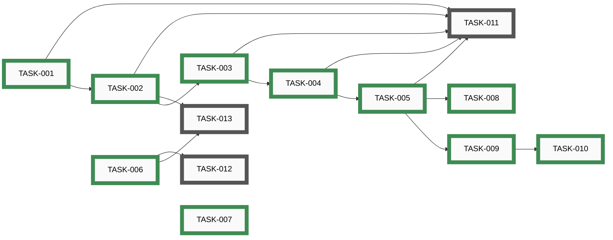

# Epics

_Auto-generated by `housekeep.py`. Do not edit manually._

**Overall:** 🔵 **active** — ████████░░ 10/13 (77%) across 1 group — 3 open · 0 active · 0 paused · 10 closed

## Index

| Epic | Title | Status | Open | Active | Paused | Closed | Done |
|------|-------|--------|-----:|-------:|-------:|-------:|------|
| [EPIC-001](#epic-001-align-with-circuitsmith-framework) | Align with CircuitSmith framework | 🔵 **active** | 3 | 0 | 0 | 10 | ████████░░ 77% |

---

## EPIC-001: Align with CircuitSmith framework

[↑ back to top](#index)

**Status:** 🔵 **active** — ████████░░ 10/13 (77%)

| Order | ID | Title | Status | Effort |
|-------|----|-------|--------|--------|
| 11 | [TASK-011](open/task-011-claude-md-rewrite.md) | Rewrite CLAUDE.md to mirror CircuitSmith's verbatim | ⚪ _open_ | Small |
| 12 | [TASK-012](open/task-012-epic-run-and-autonomy.md) | Port /epic-run skill and AUTONOMY.md, sweep HIL frontmatter on open tasks | ⚪ _open_ | Medium |
| 13 | [TASK-013](open/task-013-apply-branch-protection.md) | Apply server-side branch protection to tgd1975/PartsLedger main | ⚪ _open_ | Small |
| 1 | ~~[TASK-001](closed/task-001-delete-sync-layer.md)~~ | ~~Delete awesome-task-system/ and scripts/sync_task_system.py~~ | 🟢 closed | Small |
| 2 | ~~[TASK-002](closed/task-002-python-skeleton.md)~~ | ~~Author Python project skeleton (pyproject, requirements-dev, CI, conftest, gitignore)~~ | 🟢 closed | Small |
| 3 | ~~[TASK-003](closed/task-003-replace-pre-commit.md)~~ | ~~Replace scripts/pre-commit with the CircuitSmith version~~ | 🟢 closed | Small |
| 4 | ~~[TASK-004](closed/task-004-upgrade-commit-skill.md)~~ | ~~Upgrade /commit skill and commit-pathspec.sh to the CircuitSmith versions~~ | 🟢 closed | Small |
| 5 | ~~[TASK-005](closed/task-005-settings-json.md)~~ | ~~Author .claude/settings.json with full allowlist + deny~~ | 🟢 closed | Small |
| 6 | ~~[TASK-006](closed/task-006-docs-verbatim-port.md)~~ | ~~Port the 13 verbatim developer docs from CircuitSmith~~ | 🟢 closed | Medium |
| 7 | ~~[TASK-007](closed/task-007-architecture-doc.md)~~ | ~~Write docs/developers/ARCHITECTURE.md for the PartsLedger pipeline~~ | 🟢 closed | Medium |
| 8 | ~~[TASK-008](closed/task-008-security-review-hooks.md)~~ | ~~Port security-review hooks (pre-merge-commit, post-merge, pre-rebase)~~ | 🟢 closed | Medium |
| 9 | ~~[TASK-009](closed/task-009-codeowner-mechanism.md)~~ | ~~Port codeowner reminder mechanism (hook + registry + PreToolUse)~~ | 🟢 closed | Small |
| 10 | ~~[TASK-010](closed/task-010-codeowner-starter-skills.md)~~ | ~~Author starter co-* skills capturing PartsLedger invariants~~ | 🟢 closed | Small |
