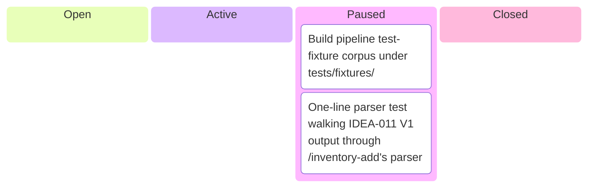
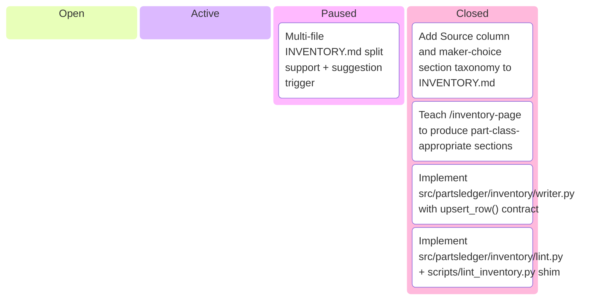
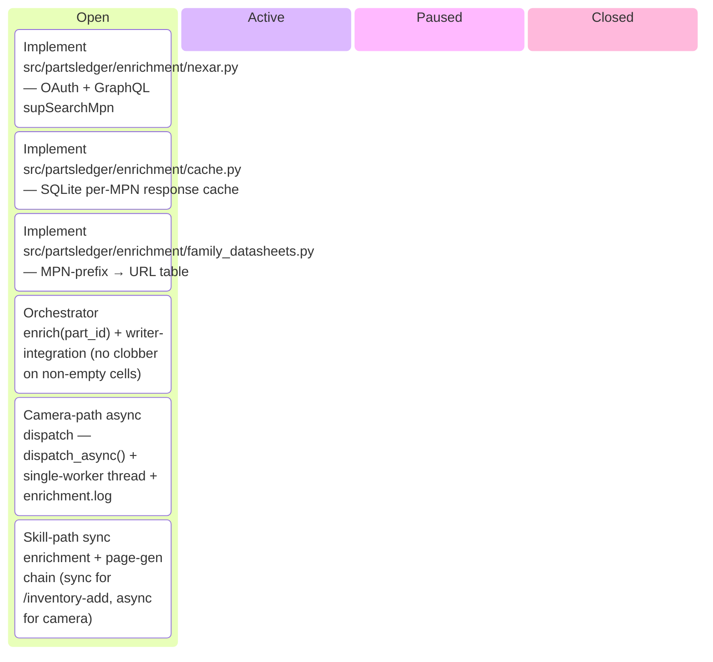
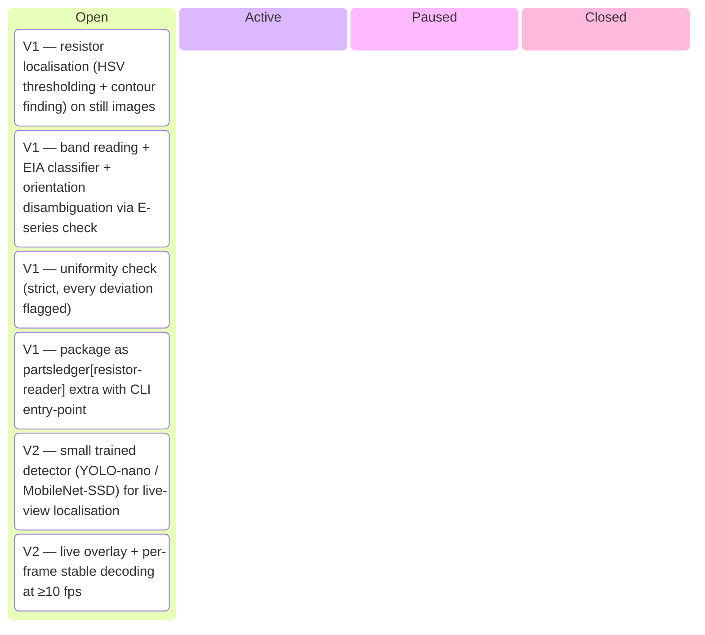
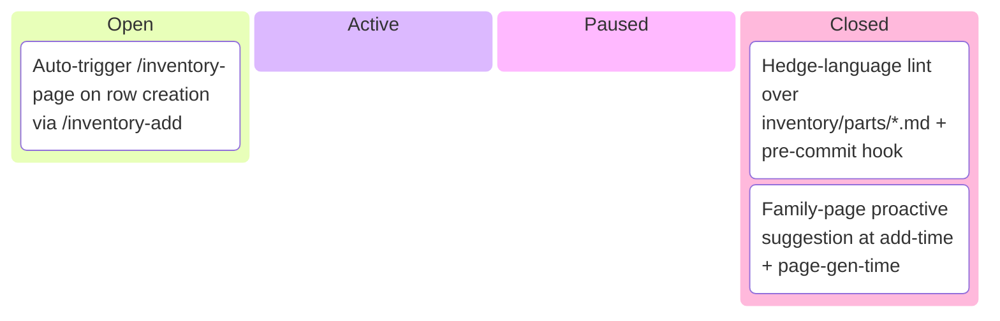
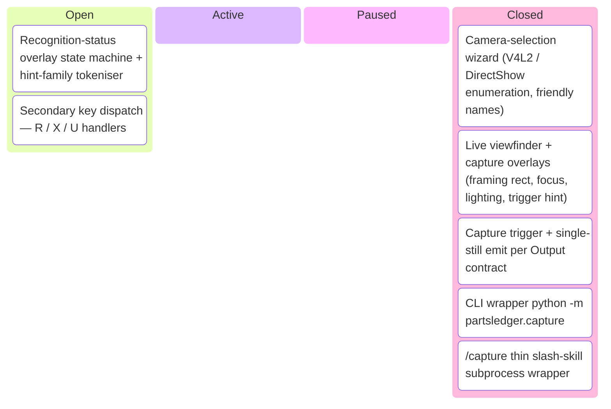
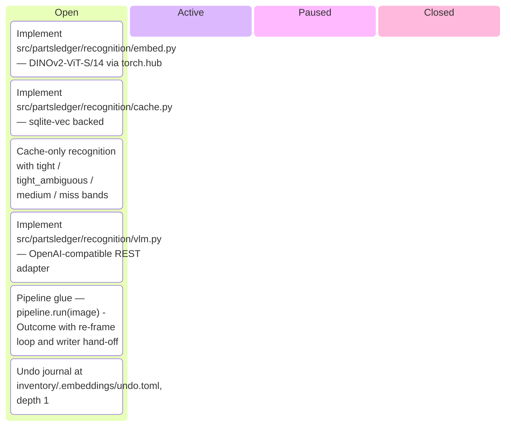

# Kanban Board

_Auto-generated by `housekeep.py`. Do not edit manually._

**Epics:** [integration-followups](#integration-followups) · [markdown-inventory-schema](#markdown-inventory-schema) · [metadata-enrichment](#metadata-enrichment) · [resistor-reader](#resistor-reader) · [skill-path-today](#skill-path-today) · [usb-camera-capture](#usb-camera-capture) · [visual-recognition](#visual-recognition)

## integration-followups

_⚪ 0 open · 🔵 0 active · 🟡 2 paused · 🟢 0 closed · ░░░░░░░░░░ 0%_

## markdown-inventory-schema

_⚪ 0 open · 🔵 0 active · 🟡 1 paused · 🟢 4 closed · ████████░░ 80%_

## metadata-enrichment

_⚪ 6 open · 🔵 0 active · 🟡 0 paused · 🟢 0 closed · ░░░░░░░░░░ 0%_

## resistor-reader

_⚪ 6 open · 🔵 0 active · 🟡 0 paused · 🟢 0 closed · ░░░░░░░░░░ 0%_

## skill-path-today

_⚪ 1 open · 🔵 0 active · 🟡 0 paused · 🟢 2 closed · ███████░░░ 67%_

## usb-camera-capture

_⚪ 2 open · 🔵 0 active · 🟡 0 paused · 🟢 5 closed · ███████░░░ 71%_

## visual-recognition

_⚪ 6 open · 🔵 0 active · 🟡 0 paused · 🟢 0 closed · ░░░░░░░░░░ 0%_

