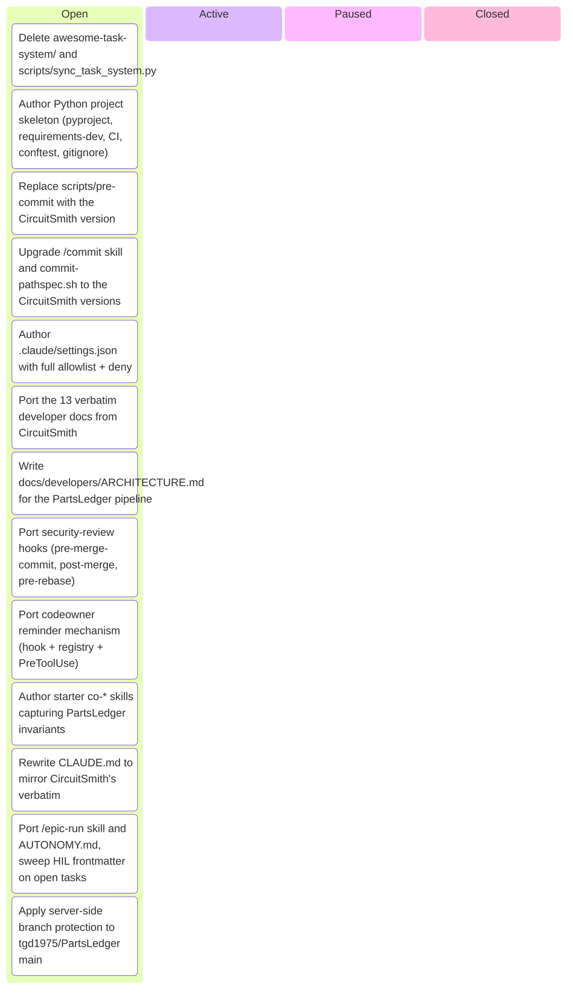

# Kanban Board

_Auto-generated by `housekeep.py`. Do not edit manually._

**Epics:** [align-with-circuitsmith](#align-with-circuitsmith)

## align-with-circuitsmith

_⚪ 13 open · 🔵 0 active · 🟡 0 paused · 🟢 0 closed · ░░░░░░░░░░ 0%_

