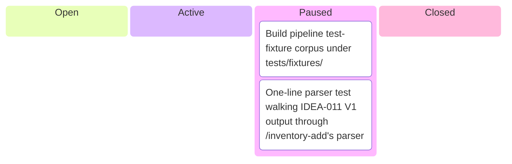
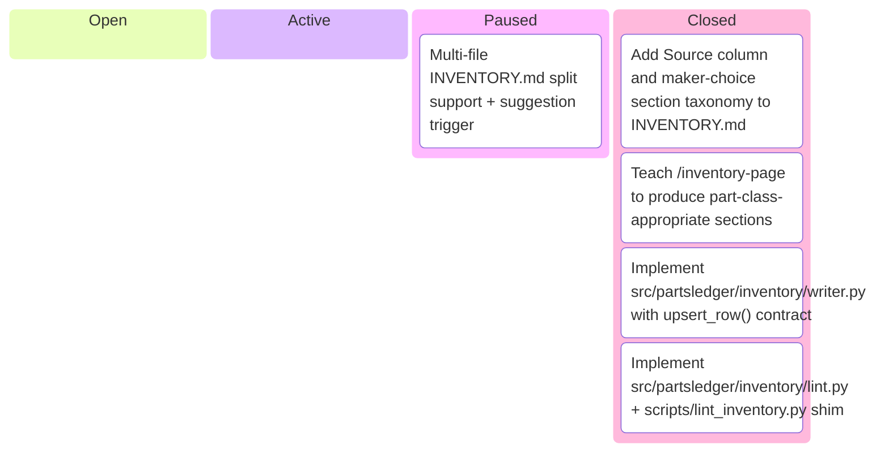
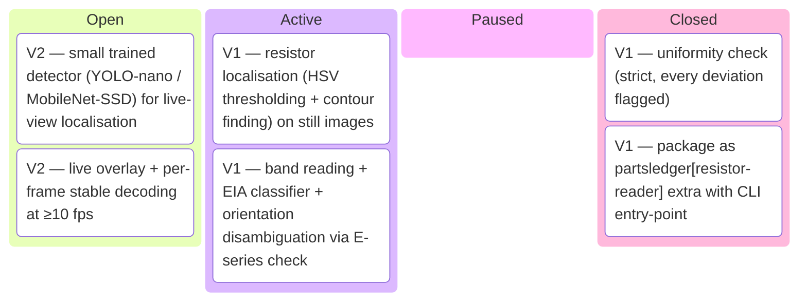
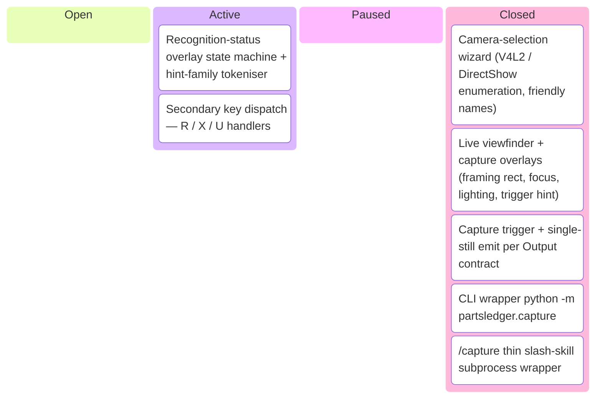
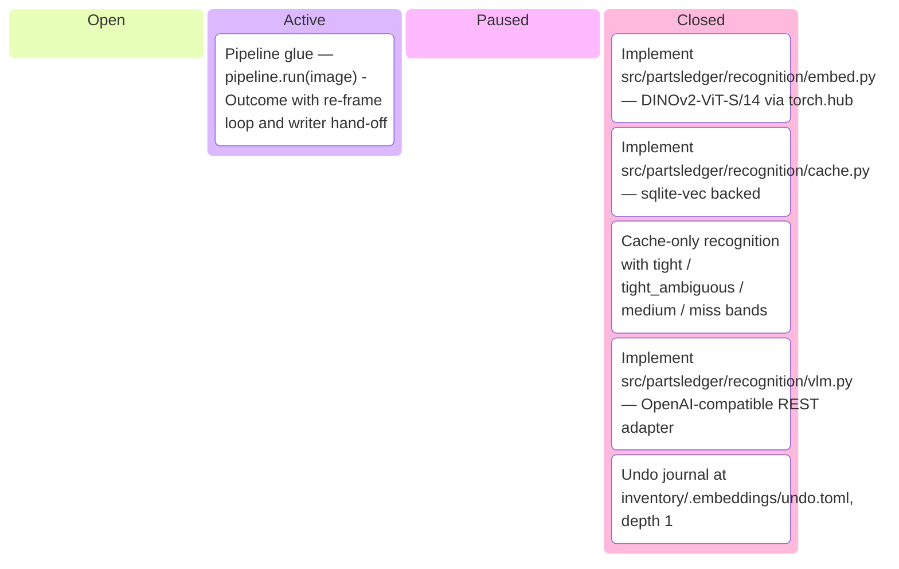

# Kanban Board

_Auto-generated by `housekeep.py`. Do not edit manually._

**Epics:** [integration-followups](#integration-followups) · [markdown-inventory-schema](#markdown-inventory-schema) · [resistor-reader](#resistor-reader) · [usb-camera-capture](#usb-camera-capture) · [visual-recognition](#visual-recognition)

## integration-followups

_⚪ 0 open · 🔵 0 active · 🟡 2 paused · 🟢 0 closed · ░░░░░░░░░░ 0%_

```mermaid
kanban
  Open
  Active
  Paused
    TASK_057["Build pipeline test-fixture corpus under tests/fixtures/"]
    TASK_058["One-line parser test walking IDEA-011 V1 output through /inventory-add's parser"]
  Closed
```

## markdown-inventory-schema

_⚪ 0 open · 🔵 0 active · 🟡 1 paused · 🟢 4 closed · ████████░░ 80%_

```mermaid
kanban
  Open
  Active
  Paused
    TASK_018["Multi-file INVENTORY.md split support + suggestion trigger"]
  Closed
    TASK_014["Add Source column and maker-choice section taxonomy to INVENTORY.md"]
    TASK_015["Teach /inventory-page to produce part-class-appropriate sections"]
    TASK_016["Implement src/partsledger/inventory/writer.py with upsert_row() contract"]
    TASK_017["Implement src/partsledger/inventory/lint.py + scripts/lint_inventory.py shim"]
```

## resistor-reader

_⚪ 2 open · 🔵 2 active · 🟡 0 paused · 🟢 2 closed · ███░░░░░░░ 33%_

```mermaid
kanban
  Open
    TASK_055["V2 — small trained detector (YOLO-nano / MobileNet-SSD) for live-view localisation"]
    TASK_056["V2 — live overlay + per-frame stable decoding at ≥10 fps"]
  Active
    TASK_051["V1 — resistor localisation (HSV thresholding + contour finding) on still images"]
    TASK_052["V1 — band reading + EIA classifier + orientation disambiguation via E-series check"]
  Paused
  Closed
    TASK_053["V1 — uniformity check (strict, every deviation flagged)"]
    TASK_054["V1 — package as partsledger[resistor-reader] extra with CLI entry-point"]
```

## usb-camera-capture

_⚪ 0 open · 🔵 2 active · 🟡 0 paused · 🟢 5 closed · ███████░░░ 71%_

```mermaid
kanban
  Open
  Active
    TASK_036["Recognition-status overlay state machine + hint-family tokeniser"]
    TASK_037["Secondary key dispatch — R / X / U handlers"]
  Paused
  Closed
    TASK_032["Camera-selection wizard (V4L2 / DirectShow enumeration, friendly names)"]
    TASK_033["Live viewfinder + capture overlays (framing rect, focus, lighting, trigger hint)"]
    TASK_034["Capture trigger + single-still emit per Output contract"]
    TASK_035["CLI wrapper python -m partsledger.capture"]
    TASK_038["/capture thin slash-skill subprocess wrapper"]
```

## visual-recognition

_⚪ 0 open · 🔵 1 active · 🟡 0 paused · 🟢 5 closed · ████████░░ 83%_

```mermaid
kanban
  Open
  Active
    TASK_043["Pipeline glue — pipeline.run(image) - Outcome with re-frame loop and writer hand-off"]
  Paused
  Closed
    TASK_039["Implement src/partsledger/recognition/embed.py — DINOv2-ViT-S/14 via torch.hub"]
    TASK_040["Implement src/partsledger/recognition/cache.py — sqlite-vec backed"]
    TASK_041["Cache-only recognition with tight / tight_ambiguous / medium / miss bands"]
    TASK_042["Implement src/partsledger/recognition/vlm.py — OpenAI-compatible REST adapter"]
    TASK_044["Undo journal at inventory/.embeddings/undo.toml, depth 1"]
```
